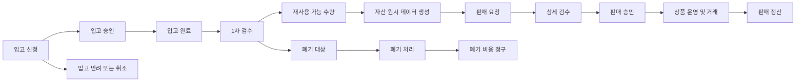

# MRS 서비스 정책

> 문서 버전: 1.0  
> 기준일: 2026-09-18  
> 적용 범위: 현재 MRS 프런트엔드 시제품 및 인증 백엔드

## 1. 문서 목적

이 문서는 현재 개발된 MRS(Material Recycling Service)의 서비스 흐름, 상태 기준, 운영 제약 및 시제품 한계를 정의한다. 화면이나 코드와 문서가 충돌하는 경우 현재 배포된 코드 동작을 우선 확인한다.

현재 서비스는 업무 흐름을 검증하기 위한 시제품이다. 회원가입, 입고, 검수, 자산, 판매, 견적, 정산 등 대부분의 업무 데이터는 브라우저 메모리의 예시 데이터이며 서버에 저장되지 않는다. 백엔드는 상태 확인과 JWT 로그인 API만 제공한다.

## 2. 서비스 참여자

| 구분 | 역할 | 현재 구현 |
| --- | --- | --- |
| 비회원 | 마켓 탐색, 상품 확인 | 프런트엔드 시제품 |
| 기업회원·공급처 | 자산 확인, 입고 신청, 판매 요청, 견적 작성, 검수 결과 및 정산 내역 확인 | 프런트엔드 시제품 |
| 관리자 | 회원, 입고, 검수, 자산, 마켓, 정산 및 기준정보 관리 | 프런트엔드 시제품 |
| 인증 사용자 | 이메일·비밀번호 로그인, 본인 프로필 조회 | 백엔드 구현 |

백엔드 사용자 역할은 `CUSTOMER`, `ADMIN`으로 구분한다. 계정 상태는 `PENDING`, `ACTIVE`, `REJECTED`, `SUSPENDED`이며 `ACTIVE` 계정만 로그인할 수 있다. 현재 관리자 화면은 인증 및 역할 검사를 연결하지 않은 독립 시제품이다.

## 3. 전체 업무 흐름

현재 시제품에서는 각 업무 데이터가 자동으로 다음 단계에 생성되거나 서버에 저장되지 않는다. 화면 간 연결, 상태 표시, 일부 상태 변경 및 입력 검증만 제공한다.

## 4. 회원 및 계정 정책

### 4.1 회원가입

- 회원 유형은 `기업회원`, `공급처`로 표시한다.
- 필수 약관은 개인정보 수집·이용 동의와 기업회원 및 공급처 이용 동의이다.
- 마케팅 및 광고 알림 동의는 선택 사항이다.
- 가입 신청 상태는 `가입 승인 대기`, `이용 중`, `승인 반려`로 표시한다.
- 관리자 가입 승인 화면은 임시 상태 변경만 수행하며 백엔드 사용자 상태를 변경하지 않는다.
- 회원가입 신청 저장, 승인 결과 이메일 발송 및 계정 자동 생성은 구현되지 않았다.

### 4.2 로그인 및 인증

- 로그인 이메일은 공백 제거 후 소문자로 정규화한다.
- 비밀번호는 8자 이상 128자 이하로 검증한다.
- 비밀번호는 scrypt 해시로 검증하며 평문으로 저장하지 않는다.
- 로그인 성공 시 HS256 JWT 액세스 토큰을 발급한다.
- `PENDING` 계정은 승인 대기 오류, `REJECTED` 및 `SUSPENDED` 계정은 이용 불가 오류를 반환한다.
- 인증 API는 로그인과 현재 사용자 조회만 구현되어 있다.
- 화면의 데모 로그인은 실제 인증 API 및 관리자 권한 제어와 연결되어 있지 않다.

## 5. 입고 정책

### 5.1 입고 신청

입고 신청에는 다음 정보가 필요하다.

- 현장명 또는 상호
- 담당자명과 연락처
- 차량 기준 예상 물량
- 자재 사진
- F등급 처리 규정 동의

차량 기준 예상 물량은 `1톤 트럭 이하`, `2.5톤 트럭 기준`, `5톤 트럭 이상`으로 구분한다. 이 값은 안내용이며 실제 자산 수량으로 자동 환산하지 않는다.

신청 경로는 다음 중 하나로 관리한다.

- 관리자 등록
- 홈페이지
- 카카오톡
- MRS고객포탈
- 기타

고객 화면은 접수 완료와 1영업일 내 안내 문구를 표시하지만 실제 신청 전송, 배차 등록 및 안내 발송은 구현되지 않았다.

### 5.2 입고 상태

| 상태 | 의미 |
| --- | --- |
| 입고 신청 | 신청이 접수되어 관리자 확인이 필요한 상태 |
| 입고 승인 | 입고 진행이 승인된 상태 |
| 입고 완료 | 물품이 입고되어 1차 검수 대상이 된 상태 |
| 입고 반려 | 운영 조건에 따라 신청이 승인되지 않은 상태 |
| 취소 | 고객 또는 관리자가 진행을 취소한 상태 |

관리자는 입고 상세 화면에서 상태를 변경할 수 있다. 상태 변경은 브라우저 메모리에만 유지되며 단계 순서, 되돌리기 제한 및 후속 레코드 자동 생성은 구현되지 않았다.

## 6. 검수 및 폐기 정책

### 6.1 1차 검수

- 1차 검수는 입고 신청번호를 기준으로 진행한다.
- 입고 수량, 재사용 가능 수량, 폐기 대상 수량 및 폐기 사유를 기록한다.
- 재사용 가능 수량은 자산 원시 데이터의 수량 기준이 된다.
- 폐기 대상 수량은 생성 자산 수량에서 제외한다.
- 1차 검수 상태는 `검수 대기`, `결과 확인 대기`, `검수 종료`이다.
- 검수 결과와 실제 폐기 완료는 서로 다른 상태로 관리한다.

관리자 화면은 1차 검수 결과, 생성된 자산 수, 폐기 수량 및 연결 자산을 조회한다. 자산 원시 데이터 생성은 자동화되어 있지 않으며 관리자가 자산 등록 또는 수정 화면에서 처리한다.

### 6.2 자산 원시 데이터

1차 검수 후 재사용 가능한 물품에 대해 자산 데이터를 생성한다. 자산은 입고 신청, 고객사, 품목, 수량, 단위, 등급 및 로케이션 등의 정보를 가진다.

- 기존 자산의 입고 신청번호와 품목코드는 변경할 수 없다.
- 취소된 입고 신청에는 신규 자산을 연결할 수 없다.
- 현재 자산의 1차 검수번호는 해당 입고 신청과 연결된 검수 기록으로 결정한다.
- 실제 1차 검수 완료 시 자산을 자동 생성하는 백엔드 처리는 구현되지 않았다.

### 6.3 상세 검수

- 상세 검수는 판매 요청이 접수된 자산만 대상으로 한다.
- 판매 요청번호를 기준으로 자산번호와 입고 신청번호를 추적한다.
- 품목·카테고리, 규격·브랜드, 등급·평가금액 및 판매 요청 수량을 확인한다.
- 상세 검수 상태는 `상세 검수 대기`, `상세 검수 완료`로 표시한다.
- 상세 검수 화면에서 자산 수정 화면으로 이동하여 자산 정보를 상세화할 수 있다.

현재 상세 검수 상태는 별도 검수 엔터티가 아니라 판매 요청의 검수 문자열에 따라 판정한다. 자산 수정 완료가 상세 검수 완료 상태로 자동 전환되지는 않으며 검수 담당자, 완료 시각, 판정 이력도 별도로 저장하지 않는다.

### 6.4 폐기

- 폐기 관리에는 1차 검수에서 폐기 수량이 0보다 크게 판정된 건만 표시한다.
- 폐기 상태는 `판정 대기`, `미처리`, `처리 예정`, `폐기 완료`로 관리한다.
- 폐기 대상에는 사유, 판정 수량, 실제 처리 수량 및 증빙을 기록할 수 있다.
- 고객의 검수 결과 확인은 폐기 또는 비용 청구 동의와 동일하지 않다.
- 고객 시제품에서는 결과 확인 후, 비용이 미산정 상태가 아니며 동의가 필요한 건에 한해 폐기 동의를 기록할 수 있다.
- 폐기 비용은 별도 청구될 수 있으며 예상 금액은 확정 또는 청구 금액이 아니다.

고객 화면에는 입고 완료일 기준 3일 후 자동 완료 안내가 있으나 실제 스케줄러와 자동 상태 변경은 구현되지 않았다. 폐기 실행, 증빙 업로드 및 비용 청구 API도 구현되지 않았다.

## 7. 품목, 카테고리 및 자산 정책

### 7.1 카테고리

- 카테고리는 최대 3차 계층으로 관리한다.
- 품목과 자산은 3차 카테고리만 선택할 수 있다.
- 같은 상위 카테고리 아래에는 동일한 이름을 중복 등록할 수 없다.
- 순환 관계와 4차 이상 카테고리는 허용하지 않는다.
- 기존 카테고리는 같은 차수 안에서만 상위 카테고리를 변경할 수 있다.
- 상위 카테고리가 미사용이면 하위 카테고리를 신규 선택하거나 활성화할 수 없다.
- 기존 연결 데이터는 카테고리가 미사용으로 바뀌어도 유지한다.
- 물리 삭제는 지원하지 않는다.

### 7.2 품목

- 품목 식별 코드는 자동 생성하며 수정할 수 없다.
- 품목명, 카테고리, 규격, 브랜드, 기준 단위 조합의 중복을 허용하지 않는다.
- 사용 중인 품목만 신규 자산에 연결할 수 있다.
- 연결 자산이 있는 품목의 기준 단위는 변경할 수 없다.
- 입고·출고·표준 단가는 원화 기준 단위당 금액이며 미입력은 `미산정`으로 취급한다.
- 품목 단가 변경은 자산 평가금액, 상품 가격 및 과거 정산에 소급 적용되지 않는다.
- 대표 이미지는 최대 1개이다.

### 7.3 자산

- 자산 등급은 `S`, `A`, `B`, `F`이다.
- 보관 상태는 `입고대기`, `보관중`, `출고완료`이다.
- 판매 상태는 `판매대기`, `판매중`, `판매완료`이다.
- 수량은 0 이상 10억 이하, 소수점 셋째 자리까지 입력할 수 있다.
- `EA`, `Box`, `본` 단위는 정수 수량만 허용한다.
- `출고완료` 자산 수량은 0이어야 하며 다른 보관 상태의 수량은 0보다 커야 한다.
- `F`등급 또는 `입고대기` 자산은 `판매대기`로만 관리할 수 있다.
- `판매중` 자산은 반드시 `보관중`이어야 한다.
- `보관중` 자산은 로케이션 지정이 필수이다.
- 자산 이미지는 최대 8개이며 JPG, PNG, WebP 파일을 각 5MB까지 선택할 수 있다.
- 자산 수정 시 변경 사유와 항목별 변경 전후 값을 브라우저 메모리에 기록한다.
- 부분 출고, 자산 분할, 복수 로케이션 배치는 지원하지 않는다.

## 8. 판매 및 마켓 정책

### 8.1 판매 요청과 승인

- 판매 요청 상태는 `승인 대기`, `승인 완료`, `반려`이다.
- 판매 요청 목록에는 상세 검수 진행 여부와 승인 상태를 분리하여 표시한다.
- `승인 완료`로 변경하려면 해당 판매 요청의 상세 검수가 완료되어야 한다.
- 상세 검수 대기 건을 승인하려 하면 변경을 거부하고 안내 메시지를 표시한다.
- 일괄 승인 대상 중 상세 검수 대기 건이 하나라도 있으면 전체 일괄 변경을 거부한다.
- 반려 또는 승인 대기로의 변경에는 상세 검수 완료 조건을 적용하지 않는다.
- 판매 승인 완료가 상품 생성, 판매 시작, 고객 통지 또는 재고 차감으로 자동 연결되지는 않는다.

### 8.2 상품

- 상품 상태는 `판매대기`, `판매 중`, `재고 없음`이다.
- `판매취소`는 독립 저장 상태가 아니라 상품을 `판매대기`로 전환하는 관리자 동작이다.
- 상품은 연결 자산의 카테고리와 등급을 사용한다.
- 고객 마켓의 예시 상품과 관리자 상품 데이터는 현재 서로 자동 동기화되지 않는다.

### 8.3 구매 견적

- 견적 상태는 `접수 대기`, `견적 회신`, `출고 완료`이다.
- 견적 요청은 상품명, 수량, 단가 스냅샷, 납품지 및 요청사항을 포함한다.
- 고객 화면에서는 견적 요청서를 작성하고 내려받을 수 있으나 공급사에 전송하지 않는다.
- 견적 상태 변경은 재고 차감, 출고, 결제 또는 정산을 실행하지 않는다.

### 8.4 기획전

- 기획전 상태는 `노출 중지`, `예약`, `진행 중`, `종료`로 계산한다.
- 시작 시각은 포함하고 종료 시각은 포함하지 않는다.
- 노출 순서는 0 이상 9,999 이하의 정수이다.
- 기획전은 선택 카테고리와 모든 하위 카테고리의 `판매 중` 상품을 포함한다.
- 미사용 카테고리의 상품은 기획전 편성에서 제외한다.
- 관리자 기획전과 고객 마켓 배너는 현재 서로 동기화되지 않는다.

## 9. 보관료, 비용 및 정산 정책

- 비용 유형은 `보관료`, `판매 정산`, `폐기 비용`이다.
- 상태는 `미청구`, `청구 완료`, `수납 완료`, `정산 완료`이다.
- 명세 금액은 등록된 명세 항목의 합계로 계산한다.
- 금액 미등록은 0원이 아니라 `미산정`이다.
- 조회 합계에는 `미청구` 명세를 제외한다.
- 표시된 예시 금액은 부가세 포함 기준이지만 자동 세액 계산은 지원하지 않는다.
- 보관료 단가, 로케이션 용량 및 자동 산정 공식은 확정되어 있지 않다.
- 판매 희망금액은 판매 수익이나 실제 지급액이 아니다.
- 수수료, 세금 및 미청구 비용이 반영되지 않을 수 있으므로 화면의 차액은 실제 정산액을 보장하지 않는다.
- 결제, 청구서 발행, 입금 및 지급 처리는 구현되지 않았다.

## 10. 문의, 알림 및 개인정보 정책

### 10.1 문의와 알림

- 문의 유형은 `서비스`, `입고`, `검수 이의`, `구매`이다.
- 문의 상태는 `미답변`, `확인 중`, `답변 완료`이다.
- 검수 문의는 최대 2,000자이며 현재 브라우저 메모리에만 기록된다.
- 고객 화면은 검수 결과, 폐기 완료, 폐기 비용, 신규 입고, 판매 완료 및 정산 완료 알림을 표시한다.
- 알림 읽음 상태는 화면 이동 중 유지되지만 새로고침하면 초기화된다.
- 이메일, 문자, 카카오톡, 푸시 알림 및 문의 전송은 구현되지 않았다.

### 10.2 개인정보

- 회원가입 화면은 회사명, 회사 연락처, 담당자명, 담당자 연락처, 이메일 및 주소를 수집 항목으로 안내한다.
- 서비스 문의는 개인정보 수집·이용 동의를 필수로 요구한다.
- 현재 문의 및 회원가입 화면의 입력값은 서버에 저장하거나 외부로 전송하지 않는다.
- 실제 운영 전 수집 주체, 처리 목적, 보유 기간, 파기 절차, 처리 위탁 및 정보주체 권리 행사 절차를 별도 확정해야 한다.

## 11. 데이터 저장 및 보안 정책

- 관리자 업무 데이터와 고객 시제품 데이터는 서로 독립된 프런트엔드 예시 데이터이다.
- 관리자 편집, 장바구니, 문의, 알림 읽음 및 고객 확인 데이터는 브라우저 메모리에만 유지된다.
- 새로고침하거나 해당 포털이 언마운트되면 임시 변경이 초기화된다.
- 현재 MariaDB 스키마에는 사용자, 카테고리, 품목 및 자산 관련 테이블이 있으나 업무 CRUD API는 연결되지 않았다.
- 백엔드에서 구현된 외부 API는 로그인, 현재 사용자 조회 및 상태 확인 API이다.
- 관리자 화면에는 인증·인가가 적용되지 않았으므로 실제 고객정보, 개인정보 또는 금융정보를 입력해서는 안 된다.
- 운영 전 HTTPS, 관리자 권한 검사, 서버 저장, 감사 로그, 파일 보안 검사, 백업·복구, 모니터링 및 개인정보 보호 조치를 적용해야 한다.

## 12. 현재 구현 범위 밖의 기능

다음 기능은 화면 문구 또는 예시 데이터가 존재하더라도 실제 업무로 실행되지 않는다.

- 회원가입 저장, 계정 승인 및 승인 결과 발송
- 입고 신청 전송, 배차 및 입고 처리 자동화
- 1차 검수 생성, 자산 자동 생성 및 검수 상태 자동 전이
- 상세 검수 완료 처리와 자산 필수 정보 완전성 자동 검증
- 폐기 실행, 증빙 업로드, 자동 완료 및 비용 청구
- 상품 자동 생성, 실제 마켓 게시 및 관리자·고객 데이터 동기화
- 견적 전송, 주문, 결제, 출고, 재고 차감 및 정산
- 실시간 알림, 이메일·문자 발송 및 문의 접수
- 서버 기반 파일 저장, 업무 감사 로그 및 복구

## 13. 운영 전 필수 확정 사항

실서비스 전 다음 정책과 기능을 확정해야 한다.

1. 입고 및 검수 단계별 변경 권한과 허용 상태 전이
2. 상세 검수 필수 필드, 완료 주체, 완료 시각 및 재검수 절차
3. F등급 판정 기준, 폐기 동의 요건, 이의 제기 기간 및 자동 처리 조건
4. 보관료·폐기비·판매 수수료·부가세 계산 및 청구 기준
5. 판매 승인 후 상품 생성, 재고 예약, 출고 및 정산 연계 규칙
6. 개인정보 보유 기간, 위탁 처리, 파기 및 정보주체 요청 절차
7. 역할별 접근권한, 변경 이력, 승인 이력 및 감사 로그 보존 기간
8. 알림 채널, 발송 실패 처리 및 고객 통지 기준
9. 데이터 백업, 장애 복구, 보안 사고 대응 및 운영 모니터링 기준

## 14. 구현 근거

주요 정책은 다음 코드에 구현되어 있다.

- 입고·검수·자산·판매 상태 및 예시 데이터: `src/admin/adminData.ts`
- 관리자 목록, 상세 및 업무 관계: `src/admin/adminViews.ts`
- 판매 승인 선행 조건과 마켓 상태 변경: `src/admin/adminMarket.ts`
- 품목 및 자산 입력 제약: `src/admin/adminInventory.ts`
- 카테고리 계층과 활성화 제약: `src/categories.ts`
- 고객 입고 신청과 F등급 처리 동의: `src/ReceivingRequest.tsx`
- 고객 검수 확인 및 폐기 동의: `src/disposals.ts`, `src/InspectionDisposals.tsx`
- 회원 약관 및 개인정보 안내: `src/RegistrationPage.tsx`, `src/PrivacyPolicyPage.tsx`
- 백엔드 인증 정책: `backend/src/auth.ts`, `backend/prisma/schema/user.prisma`

이 문서는 구현 변경 시 함께 갱신해야 한다.