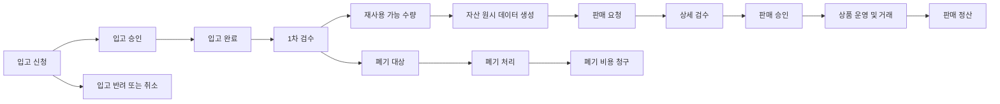

# MRS 서비스 정책

## 평가금액 정책 (2026-10-06)

- 품목 입고단가에서 S 10%·A 20%·B 40% 할인 후 원 단위 반올림한 개당 금액을 1차 검수에 자동 제안한다. 관리자는 1차 검수·상세 검수·자산 수정에서 금액을 수정하거나 비울 수 있다.
- 개당 평가금액만 DB에 저장한다. 총액은 개당 금액 × 현재 수량으로 계산해 별도 표시하며 고객 보유 합계도 계산 총액 기준이다.
- 평가금액은 선택값이고 품목코드·입고단가가 없으면 자동값은 NULL이다. 미평가와 0원을 구분하며 F등급은 자동 평가하지 않는다.
- 개당 금액은 0~1조원 정수이며 품목 단가 변경은 기존 평가금액을 소급 변경하지 않는다. 평가 할인율은 마켓 상품 판매 할인율과 별개이다.

> 문서 버전: 1.2
>
> 기준일: 2026-10-02
>
> 적용 범위: 고객사·회원·권한·자산 조회·입고 신청·승인·1차 검수·폐기 대상 동의·판매 요청 접수 및 관리자 조회. 이후 업무 흐름은 별도 표기가 없으면 시제품 정책.

## 고객사 중심 서비스 적용 사항

- 고객사는 자산 소유 주체이며 회원은 한 고객사에 소속된다. 회원 소속 변경이나 퇴사가 자산 소유권을 변경하지 않는다.
- MRS가 사업자 실재와 회원 소속을 독립된 연락 경로로 확인한다. 사업자번호 형식/체크섬 검사와 검색 성공은 소속 인증이 아니다.
- 기존 고객사는 사업자번호 정확 일치 검색으로 선택한다. 신규 고객사와 회원은 함께 신청하되 고객사 신청 승인과 회원 소속 승인은 별도 처리한다.
- 고객사 기본정보는 고객사명, 사업자등록번호, 대표자명, 사업장 주소, 대표 연락처다. 담당자 이름·전화·이메일은 회원 정보로 분리한다.
- 플랫폼 `ADMIN`은 MRS 전용이다. 고객사 역할 `VIEWER`/`MANAGER` 모두 자사 자산·입고·확정 검수를 조회하고 입고 신청할 수 있다. 검수 결과 확인과 폐기 대상 동의는 MANAGER만 가능하다. 직원 승인·권한 변경은 MRS 전담이다.
- 고객사 정지 시 모든 소속 회원의 이후 API 접근을 차단한다. 회사 복구는 개별 정지 회원을 복구하지 않으며 기존 토큰은 재사용할 수 없다. 이미 전달된 정보의 원격 회수는 보장하지 않는다.
- 고객사 삭제, 사업자번호 임의 변경, 자산 소유자 변경, 판매 후 자동 귀속 이전은 제공하지 않는다. 변경은 행위자·사유·시각·변경 전후 감사 이력을 남긴다.
- 고객 포털은 실제 자산 목록·상세·전체 집계, 입고 신청·신청내역, 확정 검수·폐기 대상 조회와 확인·동의, 판매 요청 접수·공개 마켓 상품 및 계정 정보를 제공한다. 상세 검수 완료·판매 승인은 관리자 업무이다. 폐기 실행·비용 청구·출고·정산·견적 저장 작업과 샘플 개인 거래 내역은 제공하지 않는다.
- 자산 전체 집계는 출고완료를 제외하고 총평가액을 합산한다. 수량을 다시 곱하지 않으며 미평가와 0원을 구분하고 단위별 수량은 별도 집계한다.
- 등록일은 `Asset.createdAt`이다. 실제 입고일이나 과금 기산일로 사용하지 않는다. 현재 보관료 계산은 제공하지 않는다.
- 사진은 인증된 자산 조회에서 검증된 PNG/JPEG/WebP data URL만 반환한다. 보호 여부가 확인되지 않은 외부 URL은 제외하며 서명 URL 저장소 연계는 후속 작업이다.
- 운영 전환 절차와 현재 제공 범위는 `docs/CUSTOMER_MANAGEMENT.md`를 따른다. 아래의 데모 업무 설명과 충돌하면 이 절을 우선한다.

## 1. 문서 목적

이 문서는 현재 개발된 MRS(Material Recycling Service)의 서비스 흐름, 상태 기준, 운영 제약 및 시제품 한계를 정의한다. 화면이나 코드와 문서가 충돌하는 경우 현재 배포된 코드 동작을 우선 확인한다.

고객사·계정·입고 신청과 승인·1차 검수·생성 자산·폐기 대상 확인 및 동의·판매 요청 접수·관리자 상세 검수 완료·판매 승인 및 상품 진열은 실제 DB에 저장한다. 견적·정산·실제 폐기 처리는 아직 시제품 또는 미구현 영역이며 아래 관련 예시 정책을 현재 API 기능으로 해석하지 않는다.

## 2. 서비스 참여자

| 구분 | 역할 | 현재 구현 |
| --- | --- | --- |
| 비회원 | 마켓 탐색, 상품 확인 | 프런트엔드 시제품 |
| 기업회원·공급처 | 자산 확인, 입고 신청, 판매 요청, 견적 작성, 검수 결과 및 정산 내역 확인 | 프런트엔드 시제품 |
| 관리자 | 회원, 입고, 검수, 자산, 마켓, 정산 및 기준정보 관리 | 프런트엔드 시제품 |
| 인증 사용자 | 이메일·비밀번호 로그인, 본인 프로필 조회 | 백엔드 구현 |

백엔드 사용자 역할은 `CUSTOMER`, `ADMIN`으로 구분한다. 계정 상태는 `PENDING`, `ACTIVE`, `REJECTED`, `SUSPENDED`이며 `ACTIVE` 계정만 로그인할 수 있다. 현재 관리자 화면은 인증 및 역할 검사를 연결하지 않은 독립 시제품이다.

## 3. 전체 업무 흐름

```mermaid
flowchart LR
  A[입고 신청] --> B[입고 승인]
  B --> C[입고 완료]
  A --> D[입고 반려 또는 취소]
  C --> E[1차 검수]
  E --> F[재사용 가능 수량]
  E --> G[폐기 대상]
  F --> H[자산 원시 데이터 생성]
  H --> I[판매 요청]
  I --> J[상세 검수]
  J --> K[판매 승인]
  K --> L[상품 운영 및 거래]
  G --> M[폐기 처리]
  L --> N[판매 정산]
  M --> O[폐기 비용 청구]
```

현재 시제품에서는 각 업무 데이터가 자동으로 다음 단계에 생성되거나 서버에 저장되지 않는다. 화면 간 연결, 상태 표시, 일부 상태 변경 및 입력 검증만 제공한다.

## 4. 회원 및 계정 정책

### 4.1 회원가입

- 회원 유형은 `기업회원`, `공급처`로 표시한다.
- 필수 약관은 개인정보 수집·이용 동의와 기업회원 및 공급처 이용 동의이다.
- 마케팅 및 광고 알림 동의는 선택 사항이다.
- 가입 신청 상태는 `가입 승인 대기`, `이용 중`, `승인 반려`로 표시한다.
- 관리자 가입 승인 화면은 임시 상태 변경만 수행하며 백엔드 사용자 상태를 변경하지 않는다.
- 회원가입 신청 저장, 승인 결과 이메일 발송 및 계정 자동 생성은 구현되지 않았다.

### 4.2 로그인 및 인증

- 로그인 이메일은 공백 제거 후 소문자로 정규화한다.
- 비밀번호는 8자 이상 128자 이하로 검증한다.
- 비밀번호는 scrypt 해시로 검증하며 평문으로 저장하지 않는다.
- 로그인 성공 시 HS256 JWT 액세스 토큰을 발급한다.
- `PENDING` 계정은 승인 대기 오류, `REJECTED` 및 `SUSPENDED` 계정은 이용 불가 오류를 반환한다.
- 인증 API는 로그인과 현재 사용자 조회만 구현되어 있다.
- 화면의 데모 로그인은 실제 인증 API 및 관리자 권한 제어와 연결되어 있지 않다.

## 5. 입고 정책

### 5.1 입고 신청

입고 신청에는 다음 정보가 필요하다.

- 현장명 또는 상호
- 담당자명과 연락처
- 차량 기준 예상 물량
- 자재 사진 (선택, 최대 5장)
- F등급 처리 규정 동의

차량 기준 예상 물량은 `1톤 트럭 이하`, `2.5톤 트럭 기준`, `5톤 트럭 이상`으로 구분한다. 이 값은 안내용이며 실제 자산 수량으로 자동 환산하지 않는다.

신청 경로는 다음 중 하나로 관리한다.

- 관리자 등록
- 홈페이지
- 카카오톡
- MRS고객포탈
- 기타

승인된 활성 고객사 소속 활성 계정은 VIEWER/MANAGER 모두 고객 포털에서 신청할 수 있다. 현장·담당자·물량·메모·약관 동의와 선택 사진을 API로 전송하고 DB 저장 완료 후 신청번호를 표시한다. 고객사 귀속과 접수 채널·상태는 서버에서 결정한다. 고객은 회사 전체 신청내역을 조회하고 관리자는 입고 신청 목록·상세에서 실제 신청 정보와 사진을 확인한다. 사진은 공개 S3 URL로 저장되므로 개인정보·민감한 내용은 첨부하지 않는다. 배차 등록 및 안내 발송은 구현되지 않았다.

### 5.2 입고 상태

관리자는 `입고 신청` 상태인 건만 승인 또는 반려할 수 있다. 승인·반려 모두 사유 입력이 필수이며 상태·처리자·처리 시각·사유·변경 전후 값을 하나의 DB 트랜잭션으로 저장한다. 고객 신청 상세에도 처리 결과·시각·사유를 공개하므로 내부 전용 메모나 개인정보를 사유에 입력하지 않는다. 이미 처리된 건은 재처리하지 않으며 동시 요청은 한 건만 성공한다. 승인 시 배차·입고 완료·검수·자산 생성은 자동 실행하지 않는다. 취소·재심사는 아직 제공하지 않는다.

| 상태 | 의미 |
| --- | --- |
| 입고 신청 | 신청이 접수되어 관리자 확인이 필요한 상태 |
| 입고 승인 | 입고 진행이 승인된 상태 |
| 입고 완료 | 물품이 입고되어 1차 검수 대상이 된 상태 |
| 입고 반려 | 운영 조건에 따라 신청이 승인되지 않은 상태 |
| 취소 | 고객 또는 관리자가 진행을 취소한 상태 |

신규 신청은 `입고 신청` 상태다. 승인된 건의 실제 입고일시를 관리자가 등록하면 `입고 완료`와 대기 검수증 하나를 함께 생성한다. 승인만으로 입고 완료를 처리하지 않는다.

## 6. 검수 및 폐기 정책

### 6.1 1차 검수

- 1차 검수는 입고 신청번호를 기준으로 진행한다.
- 입고 수량, 재사용 가능 수량, 폐기 대상 수량 및 폐기 사유를 기록한다.
- 재사용 가능 수량은 자산 원시 데이터의 수량 기준이 된다.
- 폐기 대상 수량은 생성 자산 수량에서 제외한다.
- 1차 검수 상태는 `검수 대기`, `결과 확인 대기`, `검수 종료`이다.
- 검수 결과와 실제 폐기 완료는 서로 다른 상태로 관리한다.

관리자는 최대 1000행 결과를 입력하거나 표준 XLSX로 가져와 초안 저장·확정한다. 초안은 고객에게 공개되지 않고 자산·폐기를 생성하지 않는다. 확정 시 재사용 양수 행만 보관중·판매대기·미평가 자산으로 생성하고 폐기 대상은 별도 기록한다. 입고수량은 재사용+폐기와 같아야 하며 F등급 재사용은 0이다. 전체 전량 폐기는 제외하고 개별 전량 폐기 행은 허용한다. 고객 확인·동의 또는 자산 후속 변경 전까지만 사유를 남겨 정정할 수 있다. 확정 후 행 구성·순서·품목·단위·재사용 여부와 실제 입고일은 바꿀 수 없다.

### 6.2 자산 원시 데이터

1차 검수 후 재사용 가능한 물품에 대해 자산 데이터를 생성한다. 자산은 입고 신청, 고객사, 품목, 수량, 단위, 등급 및 로케이션 등의 정보를 가진다.

- 기존 자산이 참조하는 품목 자체는 변경할 수 없다. 품목 마스터 코드 변경 시 같은 품목을 가리키는 자산 참조는 함께 갱신된다.
- 자산 코드는 실제 입고일의 `YYMMDD`와 해당 입고일 내 4자리 일련번호를 조합한 `YYMMDD-NNNN` 형식으로 생성한다. 일련번호는 날짜별 `0001`부터 시작하며 중복될 수 없다.
- 취소된 입고 신청에는 신규 자산을 연결할 수 없다.
- 현재 자산의 1차 검수번호는 해당 입고 신청과 연결된 검수 기록으로 결정한다.
- 품목 연결은 선택이며 미연결은 null이다. 자산명·단위는 필수, 규격·카테고리 코드는 선택이다. 미입력 분류는 미분류로 표시하며 입력한 분류는 활성 3차 코드여야 한다. 재사용 자산은 활성 로케이션이 필수다. 가상 품목·분류는 생성하지 않는다.

### 6.3 상세 검수

- 상세 검수는 판매 요청이 접수된 자산만 대상으로 한다.
- 판매 요청번호를 기준으로 자산번호와 입고 신청번호를 추적한다.
- 품목·카테고리, 규격·브랜드, 등급·평가금액 및 판매 요청 수량을 확인한다.
- 상세 검수 상태는 `상세 검수 대기`, `상세 검수 완료`로 표시한다.
- 상세 검수 화면에서 자산 수정 화면으로 이동하여 자산 정보를 상세화할 수 있다.

상세 검수 상태는 판매 요청의 `inspection` 값으로 관리한다. 자산 수정만으로 자동 완료하지 않는다. 승인 대기·상세 검수 대기 요청에서 품목·카테고리·규격·브랜드·S/A/B 등급·평가금액이 등록되고 보관중·판매대기·요청 수량 양수 및 현재 수량 일치 조건을 충족하면 완료 버튼을 활성화한다. 평가금액은 일반 편집에서 선택값이나 상세 검수 완료 전에는 등록해야 하며 0원도 등록값이다. 버튼 클릭 시 서버가 최신 자산 버전과 동일 조건을 검증하고 `COMPLETED`로 저장한다. 완료 후 판매 요청 수량은 확인 완료로 표시한다. 담당자·완료 시각·변경 전후 값은 감사 이력에 저장하며 판매 승인과 상품 생성은 별도 업무이다.

### 6.4 폐기

- 폐기 관리에는 1차 검수에서 폐기 수량이 0보다 크게 판정된 건만 표시한다.
- 폐기 상태는 `판정 대기`, `미처리`, `처리 예정`, `폐기 완료`로 관리한다.
- 폐기 대상에는 사유, 판정 수량, 실제 처리 수량 및 증빙을 기록할 수 있다.
- 고객의 검수 결과 확인은 폐기 또는 비용 청구 동의와 동일하지 않다.
- 실제 고객 포털에서 MANAGER는 결과 확인 후 자재·수량의 폐기에 별도 동의할 수 있다. 이 동의는 비용 청구 동의가 아니며 비용 미산정 상태에서도 가능하다. VIEWER는 조회만 한다.
- 폐기 비용은 별도 청구될 수 있으며 예상 금액은 확정 또는 청구 금액이 아니다.

실제 포털에는 자동 완료 정책을 적용하지 않는다. 동의 후에도 폐기는 미처리, 비용은 미산정이고 금액은 null이다. 폐기 실행·일정·증빙 업로드·비용 산정·청구·자동 상태 변경 API는 제공하지 않는다.

## 7. 품목, 카테고리 및 자산 정책

### 7.1 카테고리

- 카테고리는 최대 3차 계층으로 관리한다.
- 품목과 자산은 3차 카테고리만 선택할 수 있다.
- 같은 상위 카테고리 아래에는 동일한 이름을 중복 등록할 수 없다.
- 카테고리 코드는 `[대분류 2자리][중분류 2자리][소분류 2자리]`의 6자리 숫자다. 사용하지 않는 하위 구간은 `00`으로 표시한다.
- 순환 관계와 4차 이상 카테고리는 허용하지 않는다.
- 카테고리 코드는 상위 분류를 포함하므로 등록 후 코드와 상위 분류를 변경할 수 없다.
- 상위 카테고리가 미사용이면 하위 카테고리를 신규 선택하거나 활성화할 수 없다.
- 기존 연결 데이터는 카테고리가 미사용으로 바뀌어도 유지한다.
- 물리 삭제는 지원하지 않는다.

### 7.2 품목

- 품목 식별 코드는 관리자가 입력하는 6자리 숫자이며 자동 채번하지 않는다. 중복할 수 없고 등록 후에도 변경할 수 있다.
- 품목명, 카테고리, 규격, 브랜드, 기준 단위 조합의 중복을 허용하지 않는다.
- 사용 중인 품목만 신규 자산에 연결할 수 있다.
- 연결 자산이 있는 품목의 기준 단위는 변경할 수 없다.
- 입고·출고·표준 단가는 원화 기준 단위당 금액이며 미입력은 `미산정`으로 취급한다.
- 품목 단가 변경은 자산 평가금액, 상품 가격 및 과거 정산에 소급 적용되지 않는다.
- 대표 이미지는 최대 1개이다.

### 7.3 자산

- 자산 등급은 `S`, `A`, `B`, `F`이다.
- 보관 상태는 `입고대기`, `보관중`, `출고완료`이다.
- 판매 상태는 `판매대기`, `판매중`, `판매완료`이다.
- 수량은 0 이상 10억 이하, 소수점 셋째 자리까지 입력할 수 있다.
- `EA`, `Box`, `본` 단위는 정수 수량만 허용한다.
- `출고완료` 자산 수량은 0이어야 하며 다른 보관 상태의 수량은 0보다 커야 한다.
- `F`등급 또는 `입고대기` 자산은 `판매대기`로만 관리할 수 있다.
- `판매중` 자산은 반드시 `보관중`이어야 한다.
- `보관중` 자산은 로케이션 지정이 필수이다.
- 자산 이미지는 최대 8개이며 JPG, PNG, WebP 파일을 각 5MB까지 선택할 수 있다.
- 자산 수정 시 변경 사유와 항목별 변경 전후 값을 브라우저 메모리에 기록한다.
- 부분 출고, 자산 분할, 복수 로케이션 배치는 지원하지 않는다.

## 8. 판매 및 마켓 정책

### 8.1 판매 요청과 승인

고객 포털 자산 상세에서 활성 고객사 소속 VIEWER/MANAGER는 보관중·판매대기·양수 수량의 S/A/B 자산 전체 수량에 대해 판매 요청할 수 있다. 품목·분류·평가금액 미등록은 접수를 제한하지 않는다. 희망금액은 전체 수량 기준 1원~1조원 정수이며 정산액이 아니다. 요청은 DB에 승인 대기·상세 검수 대기로 저장되고 관리자 마켓 운영 > 판매 요청 및 상세 검수에서 조회한다. 요청·신청자·수량·희망금액 및 감사 이력을 원자 저장하며 자산별 중복 요청과 이미 상품이 연결된 자산의 요청은 제한한다. 접수 후 검수 결과 정정 및 자산 수량·보관/판매 상태·F등급 변경은 제한된다. 접수는 상품 생성·판매 시작·재고 차감·고객 통지를 실행하지 않는다. 상세 검수 완료와 판매 승인은 관리자 전용 API로 제공한다. 반려·일괄 승인·취소·재요청 API는 아직 제공하지 않으며 관련 설명은 향후 정책이다.

- 판매 요청 상태는 `승인 대기`, `승인 완료`, `반려`이다.
- 판매 요청 목록에는 상세 검수 진행 여부와 승인 상태를 분리하여 표시한다.
- `승인 완료`로 변경하려면 해당 판매 요청의 상세 검수가 완료되어야 한다.
- 상세 검수 대기 건을 승인하려 하면 변경을 거부하고 안내 메시지를 표시한다.
- 일괄 승인 대상 중 상세 검수 대기 건이 하나라도 있으면 전체 일괄 변경을 거부한다.
- 반려 또는 승인 대기로의 변경에는 상세 검수 완료 조건을 적용하지 않는다.
- 관리자는 상세 검수 완료 요청에 판매 단가·승인 사유를 입력하고 진열을 확인한 후 승인한다. 승인·판매 중 상품 생성·자산 판매중 상태 및 감사 이력을 원자 저장한다. 개당 평가금액을 기본 단가로 제시하되 수정할 수 있으며 전체 수량 기준 희망금액을 단가로 자동 사용하지 않는다. 고객 통지·실제 재고 차감·출고·정산은 실행하지 않는다.

### 8.2 상품

- 상품 상태는 `판매대기`, `판매 중`, `재고 없음`이다.
- `판매취소`는 독립 저장 상태가 아니라 상품을 `판매대기`로 전환하는 관리자 동작이다.
- 상품은 연결 자산의 카테고리와 등급을 사용한다.
- 실제 고객·게스트 마켓은 공개 API에서 판매 중·양수 가용 수량 상품을 조회한다. 자산 사진·분류·규격·브랜드·등급·단가·가용 수량을 표시하며 고객사·신청자 정보는 공개하지 않는다. 데모 목업 데이터는 이 흐름과 분리한다.

### 8.3 구매 견적

- 견적 상태는 `접수 대기`, `견적 회신`, `출고 완료`이다.
- 견적 요청은 상품명, 수량, 단가 스냅샷, 납품지 및 요청사항을 포함한다.
- 고객 화면에서는 견적 요청서를 작성하고 내려받을 수 있으나 공급사에 전송하지 않는다.
- 견적 상태 변경은 재고 차감, 출고, 결제 또는 정산을 실행하지 않는다.

### 8.4 기획전

- 기획전 상태는 `노출 중지`, `예약`, `진행 중`, `종료`로 계산한다.
- 시작 시각은 포함하고 종료 시각은 포함하지 않는다.
- 노출 순서는 0 이상 9,999 이하의 정수이다.
- 기획전은 선택 카테고리와 모든 하위 카테고리의 `판매 중` 상품을 포함한다.
- 미사용 카테고리의 상품은 기획전 편성에서 제외한다.
- 관리자 기획전과 고객 마켓 배너는 현재 서로 동기화되지 않는다.

## 9. 보관료, 비용 및 정산 정책

- 비용 유형은 `보관료`, `판매 정산`, `폐기 비용`이다.
- 상태는 `미청구`, `청구 완료`, `수납 완료`, `정산 완료`이다.
- 명세 금액은 등록된 명세 항목의 합계로 계산한다.
- 금액 미등록은 0원이 아니라 `미산정`이다.
- 조회 합계에는 `미청구` 명세를 제외한다.
- 표시된 예시 금액은 부가세 포함 기준이지만 자동 세액 계산은 지원하지 않는다.
- 보관료 단가, 로케이션 용량 및 자동 산정 공식은 확정되어 있지 않다.
- 판매 희망금액은 판매 수익이나 실제 지급액이 아니다.
- 수수료, 세금 및 미청구 비용이 반영되지 않을 수 있으므로 화면의 차액은 실제 정산액을 보장하지 않는다.
- 결제, 청구서 발행, 입금 및 지급 처리는 구현되지 않았다.

## 10. 문의, 알림 및 개인정보 정책

### 10.1 문의와 알림

- 문의 유형은 `서비스`, `입고`, `검수 이의`, `구매`이다.
- 문의 상태는 `미답변`, `확인 중`, `답변 완료`이다.
- 검수 문의는 최대 2,000자이며 현재 브라우저 메모리에만 기록된다.
- 고객 화면은 검수 결과, 폐기 완료, 폐기 비용, 신규 입고, 판매 완료 및 정산 완료 알림을 표시한다.
- 알림 읽음 상태는 화면 이동 중 유지되지만 새로고침하면 초기화된다.
- 이메일, 문자, 카카오톡, 푸시 알림 및 문의 전송은 구현되지 않았다.

### 10.2 개인정보

- 회원가입 화면은 회사명, 회사 연락처, 담당자명, 담당자 연락처, 이메일 및 주소를 수집 항목으로 안내한다.
- 서비스 문의는 개인정보 수집·이용 동의를 필수로 요구한다.
- 현재 문의 및 회원가입 화면의 입력값은 서버에 저장하거나 외부로 전송하지 않는다.
- 실제 운영 전 수집 주체, 처리 목적, 보유 기간, 파기 절차, 처리 위탁 및 정보주체 권리 행사 절차를 별도 확정해야 한다.

## 11. 데이터 저장 및 보안 정책

- 관리자 업무 데이터와 고객 시제품 데이터는 서로 독립된 프런트엔드 예시 데이터이다.
- 관리자 편집, 장바구니, 문의, 알림 읽음 및 고객 확인 데이터는 브라우저 메모리에만 유지된다.
- 새로고침하거나 해당 포털이 언마운트되면 임시 변경이 초기화된다.
- 현재 MariaDB 스키마에는 사용자, 카테고리, 품목 및 자산 관련 테이블이 있으나 업무 CRUD API는 연결되지 않았다.
- 백엔드에서 구현된 외부 API는 로그인, 현재 사용자 조회 및 상태 확인 API이다.
- 관리자 화면에는 인증·인가가 적용되지 않았으므로 실제 고객정보, 개인정보 또는 금융정보를 입력해서는 안 된다.
- 운영 전 HTTPS, 관리자 권한 검사, 서버 저장, 감사 로그, 파일 보안 검사, 백업·복구, 모니터링 및 개인정보 보호 조치를 적용해야 한다.

## 12. 현재 구현 범위 밖의 기능

다음 기능은 화면 문구 또는 예시 데이터가 존재하더라도 실제 업무로 실행되지 않는다.

- 회원가입 저장, 계정 승인 및 승인 결과 발송
- 입고 승인·반려·취소 저장, 배차 및 입고 처리 자동화
- 1차 검수 생성, 자산 자동 생성 및 검수 상태 자동 전이
- 판매 반려·취소·재요청 처리
- 폐기 실행, 증빙 업로드, 자동 완료 및 비용 청구
- 상품 자동 생성, 실제 마켓 게시 및 관리자·고객 데이터 동기화
- 견적 전송, 주문, 결제, 출고, 재고 차감 및 정산
- 실시간 알림, 이메일·문자 발송 및 문의 접수
- 서버 기반 파일 저장, 업무 감사 로그 및 복구

## 13. 운영 전 필수 확정 사항

실서비스 전 다음 정책과 기능을 확정해야 한다.

1. 입고 및 검수 단계별 변경 권한과 허용 상태 전이
2. 상세 검수 필수 필드, 완료 주체, 완료 시각 및 재검수 절차
3. F등급 판정 기준, 폐기 동의 요건, 이의 제기 기간 및 자동 처리 조건
4. 보관료·폐기비·판매 수수료·부가세 계산 및 청구 기준
5. 승인 후 재고 예약, 출고 및 정산 연계 규칙
6. 개인정보 보유 기간, 위탁 처리, 파기 및 정보주체 요청 절차
7. 역할별 접근권한, 변경 이력, 승인 이력 및 감사 로그 보존 기간
8. 알림 채널, 발송 실패 처리 및 고객 통지 기준
9. 데이터 백업, 장애 복구, 보안 사고 대응 및 운영 모니터링 기준

## 14. 구현 근거

주요 정책은 다음 코드에 구현되어 있다.

- 입고·검수·자산·판매 상태 및 예시 데이터: `src/admin/adminData.ts`
- 관리자 목록, 상세 및 업무 관계: `src/admin/adminViews.ts`
- 판매 승인 선행 조건과 마켓 상태 변경: `src/admin/adminMarket.ts`
- 품목 및 자산 입력 제약: `src/admin/adminInventory.ts`
- 카테고리 계층과 활성화 제약: `src/categories.ts`
- 고객 입고 신청과 F등급 처리 동의: `src/ReceivingRequest.tsx`
- 고객 검수 확인 및 폐기 동의: `src/disposals.ts`, `src/InspectionDisposals.tsx`
- 회원 약관 및 개인정보 안내: `src/RegistrationPage.tsx`, `src/PrivacyPolicyPage.tsx`
- 백엔드 인증 정책: `backend/src/auth.ts`, `backend/prisma/schema/user.prisma`

이 문서는 구현 변경 시 함께 갱신해야 한다.