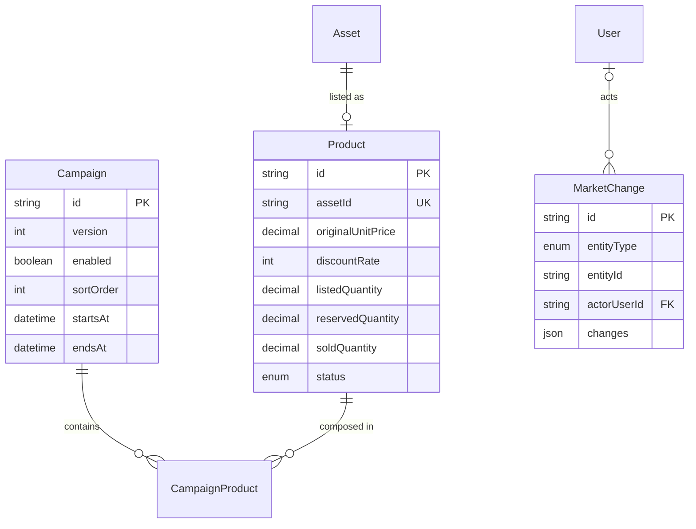

# 마켓 상품·기획전 DB 설계

## 구매 견적 요청 (2026-10-07)

`quote.prisma`의 `PurchaseQuote`·`PurchaseQuoteItem` 및 `20261007001000_add_purchase_quotes` 마이그레이션을 추가한다. 고객사별 공유, 행위자 기록, 가격·상품 스냅샷, 고유 접수 operationId, 선택 장바구니 삭제를 원자 저장한다. 기존 상품 재고·예약 수량은 변경하지 않는다. [상세 스키마·API·정책](PURCHASE_QUOTES.md)을 참고한다.

## 개인 장바구니 (2026-10-07)

신규 `cart.prisma`, 마이그레이션 `20261007000000_add_cart`:

| 테이블 | 소유·제약 | 저장 내용 |
| --- | --- | --- |
| `carts` | `userId` unique, User FK | UUID, version, 생성·변경 시각 |
| `cart_items` | `(cartId, productId)` unique, Cart/Product FK | UUID, quantity DECIMAL(18,3), 항목 version, 생성·변경 시각 |
| `cart_operations` | 요청 UUID PK, Cart FK | 정규화한 ADD/SYNC payload SHA-256, 처리 시각 |

Cart 삭제는 항목·처리 기록에 cascade, 참조 중인 Product 삭제는 restrict이다. 가격·재고는 복제하지 않고 최신 Product/Asset을 조회한다. 수량은 SQL CHECK로 0 초과~10억 이하, version은 0 이상을 강제한다. 개인 최대 100종, 소수 최대 3자리 및 거래 단위 검증은 API가 수행한다. 장바구니는 재고를 예약하지 않는다.

Serializable 트랜잭션에서 활성 계정·고객사·세션을 재확인한다. ADD/SYNC 요청 ID와 변경을 함께 저장하며 같은 ID·같은 정규화 입력 재시도는 다시 합산하지 않는다. 다른 입력 또는 다른 소유자의 요청 ID 재사용은 409이다. PATCH/DELETE는 항목 version 조건으로 충돌을 감지하며 성공 시 cart version도 증가한다. 처리 기록은 장바구니 수명 동안 보관한다.

비회원 데이터는 DB에 저장하지 않는다. 브라우저에는 가격 없는 상품 스냅샷·수량과 미완료 병합 묶음만 보관한다. Web Locks로 다중 탭 병합을 직렬화하며 미지원 브라우저는 자동 병합을 보류한다. 로그인 합산은 재고 초과·판매 중단 항목을 삭제하거나 자동 감량하지 않는다. 경고와 함께 보관하고 유효한 항목만 선택 금액에 반영한다.

- 기준일: 2026-09-28
- 구현: `backend/prisma/schema/market.prisma`
- migration: `20260928002000_add_market_products_campaigns`

## 설계 원칙

- 상품은 검수 완료된 자산과 1:1로 연결한다.
- 자산의 품목, 카테고리, 등급, 규격, 단위와 이미지는 상품에서 중복 저장하지 않고 `Asset` 관계로 조회한다.
- 상품명과 판매 가격은 마켓 운영 중 별도로 관리될 수 있으므로 상품에 저장한다.
- 기획전은 카테고리를 사용하지 않고 상품을 최대 100종 직접 편성한다. 판매대기·판매 중·재고 없음 상품을 선택할 수 있으며 고객에게는 현재 판매 가능한 상품만 노출한다.
- 상품과 기획전은 삭제하지 않고 상태 또는 `enabled`로 운영을 중지한다.
- 금액은 원 단위 정수 `DECIMAL(19, 0)`, 수량은 `DECIMAL(18, 3)`, 시간은 UTC `DATETIME(3)`으로 저장한다.



## products

| 컬럼 | 타입 | 제약 | 설명 |
| --- | --- | --- | --- |
| `id` | `VARCHAR(20)` | PK | `PRD-...` 상품 코드 |
| `assetId` | `VARCHAR(20)` | UNIQUE, FK | 판매 원천 자산. 자산당 상품 1개 |
| `name` | `VARCHAR(160)` | NOT NULL | 마켓 노출 상품명 스냅샷 |
| `originalUnitPrice` | `DECIMAL(19,0)` | NOT NULL | 할인 전 판매 단가, VAT 포함 |
| `discountRate` | `TINYINT UNSIGNED` | 0~100 | 할인율 정수 |
| `listedQuantity` | `DECIMAL(18,3)` | 0 이상 | 판매 등록 수량 |
| `reservedQuantity` | `DECIMAL(18,3)` | 0 이상 | 처리 중 구매 요청에 예약된 수량 |
| `soldQuantity` | `DECIMAL(18,3)` | 0 이상 | 출고 확정 누적 수량 |
| `minimumOrderQuantity` | `DECIMAL(18,3)` | 0 초과 | 최소 주문 수량 |
| `deliveryNotice` | `VARCHAR(1000)` | 기본 `''` | 배송비·출고 안내 |
| `status` | enum | 기본 `판매대기` | `판매대기`, `판매중`, `재고없음` |
| `publishedAt` | `DATETIME(3)` | NULL 허용 | 최초 판매 중 전환 시각 |
| `createdAt` | `DATETIME(3)` | NOT NULL | 생성 시각 |
| `updatedAt` | `DATETIME(3)` | NOT NULL | 수정 시각 |

판매 단가와 판매 가능 수량은 저장값이 아니라 다음 식으로 계산한다.

$$
unitPrice = \operatorname{round}\left(originalUnitPrice \times \frac{100-discountRate}{100}\right)
$$

$$
availableQuantity = listedQuantity - reservedQuantity - soldQuantity
$$

DB CHECK 제약은 할인율, 음수 수량, 수량 합계, 최소 주문 수량을 방어한다. 다른 행을 참조해야 하는 아래 조건은 상품 생성·수정 트랜잭션에서 자산 행을 잠그고 검사한다.

- `listedQuantity <= Asset.quantity`
- 자산의 `storageStatus = STORED`
- 자산의 `grade`가 `S`, `A`, `B` 중 하나
- 판매 중 전환 시 `availableQuantity > 0`
- 할인율 변경은 `DRAFT` 상태에서만 허용

### 상태 전이

| 현재 | 액션 | 다음 | 함께 처리할 항목 |
| --- | --- | --- | --- |
| `DRAFT` | 판매 시작 | `AVAILABLE` | `Asset.saleStatus=ON_SALE`, 최초 `publishedAt` 기록 |
| `AVAILABLE` | 판매 취소 | `DRAFT` | 활성 예약이 없을 때만 허용, `Asset.saleStatus=PENDING` |
| `AVAILABLE` | 전량 예약·판매 | `OUT_OF_STOCK` | 판매 가능 수량 0 |
| `OUT_OF_STOCK` | 수량 복구 | `AVAILABLE` 또는 `DRAFT` | 관리자가 재노출 여부 결정 |

최종 판매와 출고가 확정되어 자산 잔량이 없을 때만 `Asset.saleStatus=SOLD`로 변경한다. `Asset.storageStatus=RELEASED`는 실제 출고 완료 시점에 별도로 변경한다.

## campaigns

| 컬럼 | 타입 | 제약 | 설명 |
| --- | --- | --- | --- |
| `id` | `VARCHAR(20)` | PK | `CAM-...` 기획전 코드 |
| `name` | `VARCHAR(120)` | NOT NULL | 제목 및 고객 화면 특가 라벨 |
| `placementCode` | `VARCHAR(3)` | NOT NULL, 정확히 3자리 | 배너 등록 영역 코드, 현재 마켓 상단은 `MKT` |
| `placementName` | `VARCHAR(120)` | NOT NULL, 공백 금지 | 관리자가 인식하는 영역명 |
| `version` | `INT` | 기본 0, 음수 금지 | 동시 편집 충돌 확인 |
| `description` | `VARCHAR(1000)` | NOT NULL | 기획전 설명 |
| `enabled` | `BOOLEAN` | 기본 false | 운영자 노출 설정 |
| `sortOrder` | `SMALLINT UNSIGNED` | 0~9999 | 낮을수록 우선 노출 |
| `startsAt` | `DATETIME(3)` | NOT NULL | 노출 시작, 포함 |
| `endsAt` | `DATETIME(3)` | NOT NULL | 노출 종료, 미포함 |
| `createdAt` | `DATETIME(3)` | NOT NULL | 생성 시각 |
| `updatedAt` | `DATETIME(3)` | NOT NULL | 수정 시각 |

기획전 상태는 저장하지 않고 현재 시각에 따라 계산한다.

- `enabled=false`: 노출 중지
- `now < startsAt`: 예약
- `startsAt <= now < endsAt`: 진행 중
- `endsAt <= now`: 종료

기획전 상품 조회 조건은 다음과 같다.

1. `campaign_products`에 직접 편성된 상품
2. 상품 `status=AVAILABLE`, 공개 시각 존재
3. 자산 보관중·판매중·S/A/B, 판매 고객사 활성, 상품 분류 및 모든 상위 분류 활성
4. `availableQuantity > 0`

판매 불가 상품의 편성은 유지하며 다시 판매 가능해지면 자동 노출한다. 노출 가능 상품이 0종이면 기획전도 고객 목록에서 숨긴다. 고객 기본 정렬은 저장한 편성 순서이며 최신순·가격순·할인순 선택 시 해당 정렬을 우선한다. 할인율과 가격은 상품의 현재 값을 사용하며 기획전별 할인은 없다.

기획전 타입 배너는 영역(Slot/Placement) 코드로 노출 위치를 지정한다. 현재 고객포탈 마켓 상단 영역은 `MKT` / `고객포탈 마켓 상단 기획전`이며 이 코드의 배너만 마켓에 노출한다. 관리자는 코드와 영역명을 텍스트로 입력한다. `001` 같은 코드도 문자열 그대로 보존하며, 다른 영역에 저장한 배너는 해당 코드가 고객 화면에 연결되기 전까지 마켓에 노출하지 않는다. 같은 영역에 여러 배너를 등록할 수 있으며 기존 순서·기간·상품 노출 조건을 적용한다. 영역명은 관리자 표시용이고 코드가 고객 화면 연결 기준이다.

`20261007003000_campaign_banner_placement`은 기존 기획전 배너에 `MKT` 영역과 영역명을 채운다. 기존 편성·노출 설정·기간·순서는 유지한다. 이미지 타입 배너의 기존 위치 ID 체계는 변경하지 않는다.

### campaign_products

| 컬럼 | 타입 | 제약 | 설명 |
| --- | --- | --- | --- |
| `campaignId` | `VARCHAR(20)` | Campaign FK, 삭제 CASCADE | 기획전 |
| `productId` | `VARCHAR(20)` | Product FK, 삭제 RESTRICT | 상품 |
| `sortOrder` | `SMALLINT UNSIGNED` | 0~99 | 편성 순서 |

복합 PK `(campaignId, productId)`로 같은 기획전 내 중복을 막고 `(campaignId, sortOrder)` UNIQUE와 순서 CHECK로 최대 100종을 보장한다. 동일 상품을 여러 기획전에 편성할 수 있다. 비노출 기획전은 빈 편성으로 저장할 수 있지만 노출 사용 시 최소 1종이 필요하다.

`20261007002000_campaign_product_composition`은 기존 기획전을 모두 노출 중지하고 카테고리 FK·열을 제거한다. 기존 카테고리를 상품 편성으로 자동 변환하지 않는다. 활성 관리자의 저장은 버전 검사·편성 교체·감사 이력을 하나의 트랜잭션으로 처리한다. 운영 DB 적용 후 기존 기획전을 직접 재편성하고 노출을 다시 설정해야 한다.

## market_changes

상품과 기획전 변경을 같은 형식으로 기록하는 append-only 감사 테이블이다.

| 컬럼 | 타입 | 설명 |
| --- | --- | --- |
| `id` | `VARCHAR(36)` | UUID PK |
| `entityType` | enum | `PRODUCT`, `CAMPAIGN` |
| `entityId` | `VARCHAR(20)` | 대상 ID |
| `actorUserId` | `VARCHAR(36)` | 관리자 User FK, 시스템 변경은 null |
| `reason` | `VARCHAR(500)` | 변경 사유 |
| `changes` | `JSON` | 필드별 `before`/`after` |
| `createdAt` | `DATETIME(3)` | 변경 시각 |

다형 관계이므로 `entityId`에는 DB FK를 걸 수 없다. 서비스 계층에서 대상 존재를 확인한 뒤 대상 변경과 감사 이력 생성을 한 트랜잭션으로 처리한다. 감사 이력은 대상이 운영 중지되어도 삭제하지 않는다.

```json
{
  "status": { "before": "DRAFT", "after": "AVAILABLE" },
  "discountRate": { "before": 0, "after": 15 }
}
```

## 인덱스

- `products.assetId UNIQUE`: 자산당 상품 하나 보장
- `products(status, createdAt)`: 공개 상품 목록과 최신순 조회
- `campaigns(enabled, startsAt, endsAt, sortOrder)`: 현재 노출 기획전 조회
- `campaign_products(campaignId, sortOrder) UNIQUE`: 편성 순서 조회
- `campaign_products(productId)`: 상품별 편성 조회
- `market_changes(entityType, entityId, createdAt)`: 대상별 변경 이력
- `market_changes(actorUserId, createdAt)`: 관리자별 작업 추적

## 제외 범위

- 구매 요청, 견적, 예약 해제 및 출고 테이블
- 상품 전용 이미지. 현재는 `AssetImage`를 사용한다.
- 기획전별 개별 할인율
