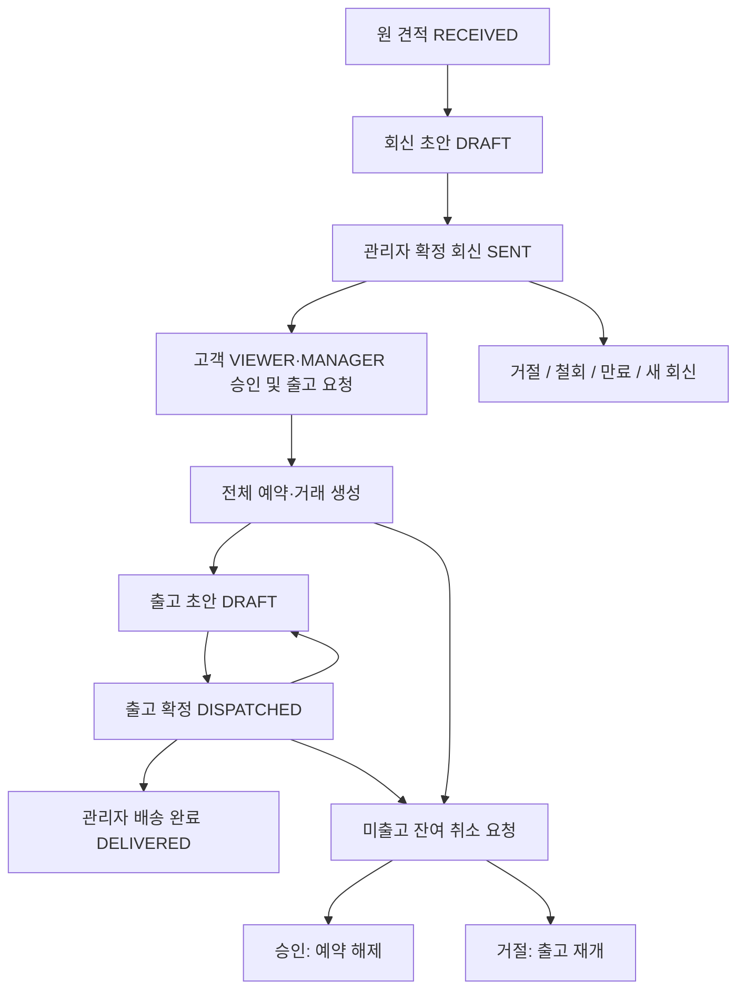

# 견적 기반 출고 정책

기준일: 2026-10-07. 정책서·DB 스키마·마이그레이션과 **회신·승인·취소·출고·배송 API 및 고객·관리자 화면을 구현했다.** 기존 견적 접수는 미예약을 유지한다. 검증용 로컬 DB에만 적용했으며 외부 DB 적용·배포는 별도 승인한다. 결제는 포함하지 않는다.

## 책임과 권한

| 업무 | 고객포탈 | 관리자 | 백엔드 |
| --- | --- | --- | --- |
| 원 견적 | VIEWER·MANAGER 요청, 자사 공유 조회 | 접수 조회 | 불변 요청 저장, 현재 가격·재고 검증 |
| 확정 회신 | 원 요청·회신 비교 | 상품·단가·수량·배송비·납품 정보 수정 및 회신 | 버전별 별도 스냅샷 보존 |
| 승인·출고 요청 | 자사 VIEWER·MANAGER 모두 즉시 승인, 거절은 MANAGER | 고객 승인 없이 예약·출고 불가 | 권한·만료·재고 재검증, 전체 원자 예약·거래 생성 |
| 출고 준비 | 승인 거래 조회 | 출고 수량·일정·운송 정보 작성 | 잔여·초안 배정 합계·취소 대기 검사 |
| 출고 확정 | 확정 출고 조회 | 부분/전체 출고 확정 | 예약 감소·판매 누계 증가·판매자 보관량 차감 |
| 배송 완료 | 배송 상태 조회 | 출고별 배송 완료 수기 처리 | 행위자·시각 기록, 재고 불변 |
| 취소 | MANAGER 요청, VIEWER 조회 | 승인·거절 또는 직접 잔여 취소 | 미출고 예약만 해제, 출고분 보존 |

모든 활성 ADMIN이 관리자 작업을 수행한다. 원 요청자뿐 아니라 같은 고객사의 활성 VIEWER·MANAGER가 회신을 승인하고 출고를 요청할 수 있다. 견적 거절·잔여 취소 요청은 MANAGER만 가능하다. 모든 쓰기 트랜잭션 안에서 계정·고객사 활성 상태, 소속·역할, 세션·접근 버전을 재검증한다.

구매 고객사는 자사 거래만 조회하고 타사·없는 자료는404다. 판매자는 자사 자산 출고 수량·시각만 확인하며 구매자의 주소·연락처·다른 판매자 내역을 받지 않는다. 고객은 출고 초안을 조회하지 않는다.

## 흐름과 상태

- 원 PurchaseQuote는 RECEIVED를 유지하고 원 수량·금액·납품 정보는 덮어쓰지 않는다.
- 회신은 DRAFT/SENT/SUPERSEDED/DECLINED/WITHDRAWN/ACCEPTED다. 초안만 편집·명시적 삭제할 수 있으며 삭제 감사는 보존한다. SENT 이후 본문 변경은 새 revision으로 저장하고 이전 SENT를 SUPERSEDED로 바꾼다.
- 고객은 최신 SENT만 승인·거절한다. 철회는 관리자 SENT 작업이다. 만료는 expiresAt으로 계산하고 DB에 EXPIRED를 중복 저장하지 않는다.
- 회신 발송 직후부터 만료 전까지 승인·출고 요청이 가능하다. 만료일까지 기다리지 않는다. 승인 시 전체 수량을 예약하고 거래를 생성해 관리자 출고 준비 대상으로 등록하며, 실제 출고 확정·자산 차감은 관리자 업무다.
- 요청당 승인 거래는 최대 하나다. 승인 조건은 잠그며 취소 후 재거래는 새 견적 요청으로 시작한다. 승인본·거래를 물리 삭제하지 않는다.
- 출고 진행은 수량으로, 배송은 각 Shipment로 계산하며 취소 대기는 별도 표시한다. 잔여0이고 모든 확정 출고가 DELIVERED이면 종료한다. 정상 완료 COMPLETED, 전량 취소 CANCELLED, 부분 출고 후 잔여 취소 CLOSED_PARTIAL_CANCELLED다. 배송 중이면 잔여 취소 이후에도 미종료다.

## 회신 조건과 만료

관리자는 수량·단가 수정, 요청 상품 제외, 신규 상품 추가·대체, 배송비·주소·담당자·전화·예정일 변경이 가능하다. 중복 없는1~100종이며 대체 상품은 원 요청 항목을 연결하고 새 상품은 연결 없이 저장한다. 원 요청서와 확정 견적서를 구분한다.

승인 시 상품 활성 분류·진열·판매자·보관 상태, 규격·등급·단위·최소수량·현재 가용재고를 재검증한다. 규격·등급·단위 변경은 새 회신을 요구한다. 마켓 가격 변화만으로 확정 회신 단가를 소급하지 않는다. 재고가 부족하면 전체 승인이 실패하며 자동 감량하지 않는다.

수량0 초과~10억, 소수3자리, EA·BOX·PIECE는 정수다. 단가는 VAT 포함 KRW 정수이며0원 허용이다. 행 금액은 단가×수량을 half-up 원 단위 반올림하고 상품 합계는 행 합계, 전체는 상품 합계+VAT 포함 배송비다. 주소·담당자·전화는 승인 전 필수다.

배송비는 거래당 한 번만 기록하고 분할 출고로 복제·증액하지 않는다. 취소해도 승인 금액은 보존하고 취소 수량·상품 금액은 별도 표시한다. 배송비 재정산·청구·환불은 제외한다.

만료일 UI 기본값은 실제 회신 시점+3일(72시간)이다. 비우면 expiresAt=null, 무기한이며 서버가 null을 기본값으로 덮어쓰지 않는다. UTC 저장/KST 표시, 승인 서버 시각이 expiresAt보다 작아야 한다. 같은 시각은 만료다. 승인된 거래는 만료일이 지나도 자동 취소·예약 해제하지 않는다. 회신 단계는 미예약이므로 만료 해제 배치는 필요 없다.

## 재고 규칙

| 작업 q | Product.reservedQuantity | Product.soldQuantity | Asset.quantity |
| --- | --- | --- | --- |
| 요청·회신·초안 | 불변 | 불변 | 불변 |
| 승인 | +q | 불변 | 불변 |
| 출고 확정 | -q | +q | -q |
| 취소 승인 | -q | 불변 | 불변 |
| 배송 완료 | 불변 | 불변 | 불변 |

listedQuantity는 등록 원수량이며 차감하지 않는다. 가용=listed-reserved-sold, 거래 예약 잔여=quantity-shipped-cancelled다. 전체 거래 잔여 합과 상품 예약량이 일치해야 한다. 초안 배정 합은 잔여 이하이며 추가 예약하지 않는다. 출고 확정 시 예약·물리량을 다시 검사한다. 신규 구매의 노출 조건만으로 기존 승인 출고를 막지 않고 별도 안전 검증한다.

부분 출고 자산은 STORED/ON_SALE/기존 위치 유지, 평가 합계는 남은 수량으로 계산한다. 물리 잔량0이면 RELEASED/SOLD/locationId=null이다. 같은 위치의 다른 자산은 변경하지 않는다. 판매 잔량0이면 상품 OUT_OF_STOCK다. 예약만으로 가용0이면 AVAILABLE을 유지하되 가용량 필터로 제외한다. 레거시 판매 등록량이 물리량보다 작아 비판매 잔량이 남으면 자산은 STORED/PENDING을 유지한다.

여러 판매자 상품을 한 출고에 포함할 수 있으며 집품은 자산별 현재 위치로 진행한다. 구매자 자산 자동 생성·판매자 소유권 이전은 없다. 일반 자산 편집·검수 정정·상품 운영의 기존 변경 방어를 유지해 예약·출고를 임의 덮어쓰지 않게 한다.

## 출고·배송·취소

운송 방법은 DELIVERY/SELF_PICKUP, 배송사·차량·운송장·메모는 선택 수기 정보다. 납품 조건은 승인본을 복사하고 수정 수단으로 사용하지 않는다. 초안만 수정·취소 가능하다. 확정 후 상품·수량·주소 수정·되돌림은 없다.

출고 확정은 거래 누계·상품 예약/판매 누계·자산 수량/상태/위치·감사·멱등성 영수증을 한 트랜잭션에서 처리한다. 실패는 전체 롤백이다. 배송 완료는 관리자 출고별 작업이고 고객 수령 버튼·배송사 실시간 추적은 없다. 재시도는 수량을 재차감하지 않는다.

취소는 MANAGER가 사유를 남겨 미출고 전체 잔여를 요청한다. 개별 잔여 상품만 선택 취소는 제외하며 잔여0은 요청 불가다. PENDING은 거래당 하나이고 요청 당시 잔여 스냅샷을 남긴다. 대기 중 새 출고 준비·확정을 막되 예약은 유지하고 이미 출고한 배송 완료는 허용한다.

승인 시 잔여를 취소 누계에 반영·예약 해제하고 DRAFT 출고를 CANCELLED로 바꾼다. 거절 시 출고 재개, 관리자 직접 취소도 동일 규칙·필수 사유다. 결정 이력 불변, 재요청은 새 이력이다. 승인 조건 변경은 출고 전 취소 후 새 견적, 부분 출고 후에는 잔여 취소만 가능하다. 출고 원복·반품·교환은 없다.

## 오류·검증·제외

입력400/미인증401/권한403/타사·없음404, 버전·만료·재고·취소대기·초과출고·잘못된 전이는409다. 모든 쓰기는 operationId UUID와 정규화 SHA-256을 사용하고 같은 actor/action/target/hash만 재시도한다. 다른 본문 재사용은409다. 버전검사·감사·영수증은 업무 변경과 함께 저장한다.

Prisma validate/generate, 타입·빌드, 격리 MySQL 전체 마이그레이션·CHECK/FK/unique 및 기존 데이터 보존을 검증한다. 실제 DB에서 승인 재고 경쟁, 출고/취소 race, 멱등 재시도, 감사 롤백, 권한·격리, 기본72시간/null/만료, 부분/최종 출고를 검증했다. HTTP 인증·입력·OpenAPI, 문서 이스케이프, 로컬 화면 승인·부분 출고·잔여 취소·배송 완료와 데스크톱/모바일 레이아웃도 확인했다. [DB 설계·API 계약](OUTBOUND_SCHEMA.md)를 참고한다.

고객 구매 견적 상세에서 원 요청·회신 비교, VIEWER·MANAGER 승인 및 출고 요청, MANAGER 거절·잔여 취소 요청을 제공하고 구매·출고 내역 메뉴에서 승인 거래·확정 출고를 조회한다. 관리자 마켓 운영 > 구매 견적에서 회신 초안·상품 추가/대체/제외·발송/철회, 출고 관리에서 분할 출고 초안·확정·배송 완료·취소 결정을 제공한다. 저장 스냅샷 기반 HTML 확정 견적서·출고 명세를 다운로드한다. 결제·입금·PG·환불·정산·세금계산서·물류사 API·자동 알림·구매자 자산 생성·반품·교환·출고 원복은 제외한다.