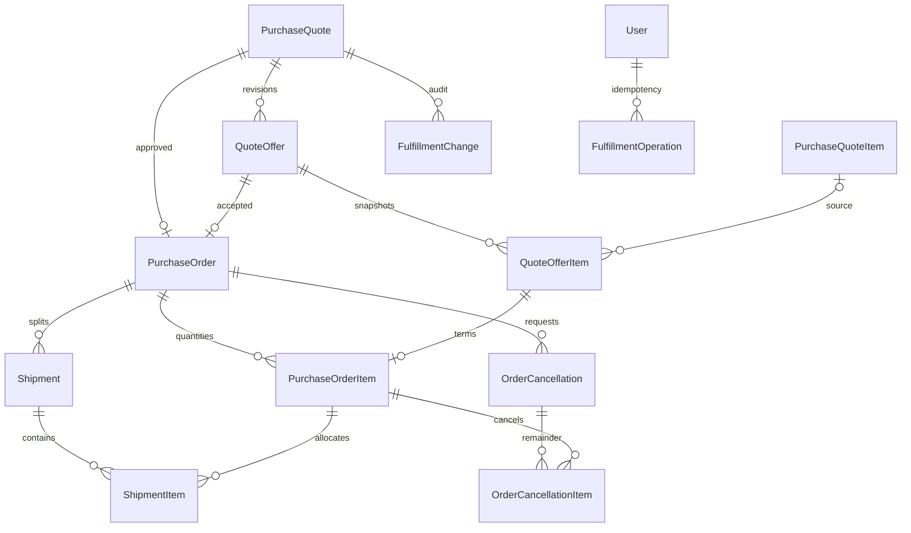

# 견적 기반 출고 DB 설계

2026-10-07. [정책](OUTBOUND_POLICY.md), [Prisma 모델](../backend/prisma/schema/outbound.prisma), [신규 SQL](../backend/prisma/migrations/20261007004000_quote_fulfillment/migration.sql), [실행 API](../backend/src/outbound.ts). **DB·트랜잭션·API·고객/관리자 화면 구현 완료, 외부 미배포다.**

## 관계



## 모델과 필드

| 테이블 | 주요 필드 | 고유·검색 |
| --- | --- | --- |
| quote_offers | quoteId,revision,status,version,createdById/sentById,sentAt/expiresAt,납품 정보,shippingFee/itemTotal/grandTotal | unique(quoteId,revision), unique(quoteId,id), index(quoteId,status), index(status,expiresAt) |
| quote_offer_items | offerId,sourceQuoteItemId?,productId/assetId/sellerCustomerId,sellerName,상품 스냅샷,sortOrder,quantity/unitPrice/total | unique(offerId,productId), unique(offerId,sortOrder), 공급자 FK |
| purchase_orders | code,quoteId,offerId,customerId,approvedById/approvedAt,version,closure?/closedAt? | code/quoteId/offerId 각각 unique, index(customerId,approvedAt,id) |
| purchase_order_items | orderId,offerItemId,productId,quantity,shippedQuantity,cancelledQuantity | offerItemId unique, unique(orderId,productId), unique(orderId,id) |
| shipments | code,orderId,status/version,scheduledAt/dispatchedAt/deliveredAt,작업자,납품 정보,carrier/vehicle/trackingNumber/note | code unique, unique(orderId,id), index(orderId,status), index(status,scheduledAt) |
| shipment_items | orderId,shipmentId,orderItemId,quantity | unique(shipmentId,orderItemId), 동일 거래 복합 FK |
| order_cancellations | orderId,status/version,requestedById/requestedAt/reason,decidedById/decidedAt/decisionReason | unique(orderId,id), index(orderId,status) |
| order_cancellation_items | orderId,cancellationId,orderItemId,quantity | unique(cancellationId,orderItemId), 동일 거래 복합 FK |
| fulfillment_changes | quoteId,orderId?,targetType/targetId,actorUserId,action,reason,changes JSON,createdAt | 요청/거래 FK, index(quoteId,createdAt), index(orderId,createdAt) |
| fulfillment_operations | operationId,actorUserId,action,targetId,payloadHash,resultResourceId,result JSON,createdAt | operationId PK, index(actorUserId,createdAt) |

UUID/VARCHAR36 내부 ID, 고객·상품 VARCHAR20, 자산 VARCHAR11이다. 모든 필드·관계·주요 제약에 한국어 Prisma 주석을 둔다. 상품 스냅샷은 name/category/grade/unit/specification/brand/imageUrl이며 필드 길이·기본값은 모델을 기준으로 한다.

수량 DECIMAL(18,3), 단가·배송비 DECIMAL(19,0), 합계 DECIMAL(24,0), UTC DATETIME(3), 납품일 한국 달력 DATE다. API 수량·금액은 문자열이며 업무 금액은 Decimal로 계산한다. expiresAt=null은 무기한, 발송 입력에서 생략하면 서버 발송 시각+72시간이다. 관리자 발송 확인에서 기본72시간·무기한·직접 지정을 선택한다.

## DB 제약

- 요청당/회신당 거래 하나, 회신 revision·상품·순서 및 거래/출고/취소 내 상품 중복 금지.
- Order(quoteId,offerId)→Offer(quoteId,id)로 다른 요청의 회신 혼입 방지.
- 출고·취소 항목은 동일 orderId를 공유하는 복합 FK 두 개로 다른 거래의 항목 혼입 방지.
- 수량0 초과~10억, 누계0 이상, shipped+cancelled<=quantity. 금액0 이상, 행 금액=ROUND(unitPrice*quantity,0), grandTotal=itemTotal+shippingFee. 양수 exact DECIMAL ROUND는 half-up이다.
- revision1 이상/version0 이상/sortOrder0~99/등급 S·A·B.
- DRAFT 회신 발송자·시각 null, 발송 상태는 필수, 만료는 sentAt 이후.
- DISPATCHED 출고 시각·작업자 필수, DELIVERED 완료 시각·작업자 필수 및 완료>=출고. DRAFT/CANCELLED는 출고·배송 처리 정보 null.
- 취소 결정 시각·관리자·사유 필수, 결정>=요청. 감사·취소 사유 공백 금지. 거래 종료 사유·시각은 둘 다 있거나 없으며 종료>=승인.
- 참조 문서·상품·자산·고객·작업자는 삭제 Restrict, FK 갱신 Restrict. 초안 교체는 자식부터 명시적 삭제.

CHECK는 SQL에 있으므로 Prisma diff만으로 다시 만들면 빠질 수 있다. 기존 migration은 수정하지 않는다.

## 서비스 제약과 원자적 작업

DB만으로 업무를 보장하지 않는다. 실행 Serializable 트랜잭션에서 검사한다: 작업별 고객/ADMIN 권한·활성 상태·세션, 요청 고객사=거래 고객사, 원 요청 항목 소속, 상품/자산/판매자 일치, 거래 항목의 승인 회신·상품·수량 일치, 회신1~100종 및 행 합계, 단위·최소수량, 최신 SENT·만료, 발송/승인/출고 이후 본문 불변 및 적법한 상태 전이.

PENDING 취소는 거래당 하나, 잔여 전체 스냅샷, 대기 중 출고 차단, 초안 합<=잔여, 출고 합=shipped, 취소 합=cancelled, 상품 예약=거래 잔여 합·판매누계=출고 합·물리수량 정합성을 검사한다. 종료는 잔여0 및 배송완료를 확인한다. 감사 orderId의 quote 일치, 다형적 targetType/targetId 실존·소속도 서비스 검증이며 targetId FK는 없다.

기존 customerTransaction Serializable을 재사용하고 거래.version 조건부 증가로 출고/취소를 직렬화한다. 승인은 요청·회신·상품을 일정한 ID 순서로 잠금·조건부 갱신한다. P2002/P2034는409다.

| 작업 | 같은 트랜잭션의 변경 |
| --- | --- |
| 회신 | 재인증·버전·상품 검사, 이전 SENT→SUPERSEDED, 새 SENT, 감사·영수증 |
| 승인·출고 요청 | VIEWER·MANAGER·최신 회신·만료 전·재고 확인, 전체 예약, Order/Item, Offer ACCEPTED, 감사·영수증 |
| 출고 | 거래/출고 버전·취소·잔량 확인, DISPATCHED, shipped 증가, reserved 감소/sold 증가, Asset 수량·상태·위치, AssetChange·거래 감사·영수증 |
| 취소 요청 | MANAGER·거래 버전·PENDING 부재, 잔여 스냅샷, 감사·영수증 |
| 취소 승인 | 관리자·버전, cancelled 증가/reserved 감소, 초안 CANCELLED, 결정·종료검사·감사·영수증 |
| 취소 거절 | 관리자·버전, 예약 유지, 결정·감사·영수증 |
| 배송 완료 | 관리자·거래/출고 버전, DELIVERED, 종료검사·감사·영수증, 수량 불변 |

Operation은 성공만 업무 변경과 함께 저장한다. 같은 actor/action/target/hash 재시도는 권한 재검증 후 기존 결과, 다른 조합은409다. result JSON은 최소 참조만 담고 비밀번호·토큰·주소·전화는 제외한다. 실패 시 전체 롤백한다.

## 실행 API 계약

인증 및 private,no-store 공통. 관리자 쓰기는 활성 ADMIN이다. 고객 승인·출고 요청은 자사 활성 VIEWER·MANAGER 모두 가능하며, 거절·잔여 취소 요청은 MANAGER만 가능하다. `/api/customer/offers/{id}/accept`는 발송 직후부터 만료 전까지 즉시 처리할 수 있다. 승인 거래 생성이 출고 요청이며 실제 출고 확정은 관리자만 수행한다.

| 경로 | 용도 |
| --- | --- |
| POST /api/admin/quotes/{id}/offers | 새 revision 초안 |
| PUT /api/admin/offers/{id} | 초안 편집 |
| POST /api/admin/offers/{id}/delete | 초안 명시 삭제·감사 보존 |
| POST /api/admin/offers/{id}/send 또는 /withdraw | 회신·철회 |
| GET /api/customer/quotes/{id}/offers | 자사 원 요청·회신·승인 거래, 초안 제외 |
| GET /api/admin/quotes/{id}/offers | 원 요청·모든 회신·승인 거래 |
| POST /api/customer/offers/{id}/accept 또는 /decline | 승인·거절 |
| GET /api/customer/orders 및 /{id} | 자사 거래·확정 출고 |
| POST /api/customer/orders/{id}/cancellations | 전체 잔여 취소 요청 |
| GET /api/admin/orders 및 /{id} | 작업 조회 |
| POST /api/admin/orders/{id}/shipments | 출고 초안 |
| PUT /api/admin/shipments/{id} | 초안 편집 |
| POST /api/admin/shipments/{id}/cancel 또는 /dispatch 또는 /deliver | 초안 취소·출고·배송 완료 |
| POST /api/admin/cancellations/{id}/approve 또는 /reject | 취소 결정 |
| POST /api/admin/orders/{id}/cancel | 관리자 직접 잔여 취소 |

쓰기 공통 `{operationId:UUID,version:0이상 정수,reason:1~500자}`이며 모두 200 `data.{quoteId,offerId?,orderId?,shipmentId?,cancellationId?,replayed}`다. 출고·취소 결정은 orderVersion도 포함한다. 거래 ID 대상 잔여 취소 요청·직접 취소는 version이 거래 버전이다. 신규 회신 version=0, 신규 출고 version/orderVersion은 거래 버전, 기존 출고·취소 결정 version은 해당 문서 버전이다. 승인 금액·수량·상태·합계는 서버 결정, 미정의 필드 거부다. 충돌은 `error.code=CONFLICT`와 `error.details[].code`의 OFFER_CHANGED/OFFER_EXPIRED/INSUFFICIENT_STOCK/CANCELLATION_PENDING/INVALID_SHIPMENT/OPERATION_CONFLICT/STOCK_LEDGER_MISMATCH로 구분한다.

- 회신 초안 추가 입력: contactName/phone 필수, email(빈 문자열 허용), address, deliveryDate(`YYYY-MM-DD` 또는 null), deliveryMethod(DELIVERY/SELF_PICKUP), expiresAt(ISO offset 또는 null), shippingFee(0~1조원 정수 문자열), note, items(1~100종 `{productId,sourceQuoteItemId:UUID|null,quantity,unitPrice}`). 수량·단가는 문자열, 서버 반올림·합계다.
- 발송은 expiresAt을 생략하면 실제 발송+72시간, null이면 무기한, 지정 ISO 시각은 미래여야 한다. 초안 만료 입력은 발송 확인 시 최종 선택한 값으로 결정한다.
- 출고 초안 추가 입력: scheduledAt(ISO 또는 null), carrier/vehicle/trackingNumber(각160자), note(1000자), items(1~100종 `{orderItemId:UUID,quantity}`). 승인 납품 조건을 서버에서 복사하고 변경 입력을 받지 않는다.
- 회신 조회: `data.{quote,offers,order}`. 거래 상세: `data.order`. 거래 목록: page/size/q, size최대100 → `data.{records,total,page,size}`. 고객은 내부 판매자·자산·현재 위치·행위자 정보를 받지 않으며 DRAFT/CANCELLED 출고를 제외한다. 관리자는 item.assetId/locationId로 집품 대상을 확인한다.
- 거래의 cancelledItemTotal은 승인 단가×취소 수량의 행별 half-up 합계다. 승인 grandTotal·shippingFee는 보존하며 재정산·환불 금액이 아니다.
- 감사 JSON은 before/after/input/result를 트랜잭션 안에서 저장한다. 영수증 result는 최소 참조만 포함한다. UI는 재시도에 동일 ID를 유지하고409면 재조회하며 재고를 낙관적으로 변경하지 않는다.

## 적용과 검증

20261007004000_quote_fulfillment는10개 테이블과 FK/unique/index/CHECK만 추가한다. 기존 테이블 ALTER·데이터 UPDATE/DELETE·수량 백필은 없고 기존 요청·해시·금액·수량을 보존한다. 회신·거래·출고를 자동 생성하지 않는다.

외부 적용 전 listed/reserved/sold·자산 보관량을 점검한다. 기존 reserved/sold가0 아닌 상품은 새 거래와 자동 연결하지 않으며 사용 시작 전 레거시 원장 대조·별도 승인된 전환 기준이 필요하다. 임의 초기화·차감 금지, 백업·승인 후 적용이다. 검증용 localhost:62439/receiving_preview에만 migration deploy했다. 외부 DB 접속·배포는 하지 않았다.

```sh
cd backend
npm run db:validate
npm run db:generate
npm run typecheck
npm run build
npm test
RUN_CUSTOMER_SCHEMA_TEST=1 npx tsx --test test/customer-schema.test.ts
```

CLI의 외부 환경 자동 로드를 피하기 위해 검증에 로컬 더미 DB 환경을 명시한다. validate/generate/build는 DB 접속이 없다. 격리 테스트는 임시 MySQL8.4.11 컨테이너·임시포트를 사용하고 종료 시 볼륨까지 제거한다.

검증 대상: 레거시 견적·재고 보존, 신규테이블 빈 상태, 중복 revision/거래/상품, 다른 요청 회신·다른 거래 출고/취소 FK, 음수·초과 수량·금액불일치, null만료·잘못된 만료, 상태 처리자·시각, 영수증 중복, 삭제 제한. 실제 DB에서 승인·재고 경쟁·멱등 재시도·감사 실패 롤백·VIEWER 만료 전 즉시 승인 및 거절/취소 제한·타사404·초안 비공개·출고 초과배정·부분/최종 출고·위치 해제·취소/출고 경합·대기 중 배송 완료·취소 거절/직접 취소·회신 교체/삭제/철회/거절·만료/기본72시간을 검증한다.