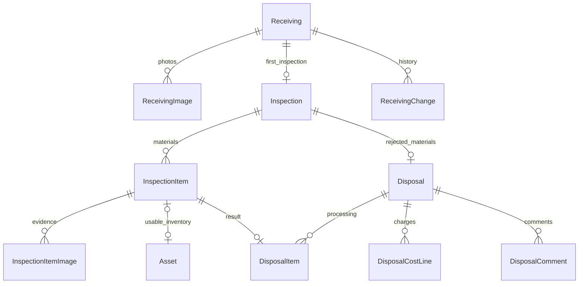

# 입고 · 검수 · 폐기 DB 설계

## 범위와 설계 근거

- 고객 입고 신청: [ReceivingRequest.tsx](../src/ReceivingRequest.tsx)
- 관리자 신청 · 검수 · 자산 · 청구 데이터: [adminData.ts](../src/admin/adminData.ts)
- 고객 폐기 내역과 확인 · 동의 · 문의 규칙: [disposals.ts](../src/disposals.ts), [InspectionDisposals.tsx](../src/InspectionDisposals.tsx)
- 업무 정책: [SERVICE_POLICY.md](../SERVICE_POLICY.md)의 5절, 6절
- 기존 자산 · 계정 모델: [asset.prisma](../backend/prisma/schema/asset.prisma), [user.prisma](../backend/prisma/schema/user.prisma)

입고 접수와 고객사 신청내역 조회 API 및 고객·관리자 화면 연동을 구현했다. 신청·사진·약관 스냅샷·신청자 감사 이력을 함께 저장하며 사진은 선택 0~5장이다. 승인된 고객사 소속 VIEWER/MANAGER 모두 신청할 수 있고 고객사 귀속은 인증 사용자로 결정한다. 상세 계약은 [API_SPEC.md](API_SPEC.md)의 고객 입고 신청 절을 참조한다. 관리자 상태 변경 저장, 검수 확정, 폐기 처리, 배차·안내 발송과 판매 요청에 따른 상세 검수는 범위에서 제외한다.

## 테이블 분리 결정

입고 신청, 검수 결과, 폐기 처리는 상태 · 담당 업무 · 발생 시점이 다르므로 별도 테이블로 관리한다. 특히 검수 종료를 폐기 완료로 해석하지 않는다. 검수 결과가 전량 재사용이면 폐기 행 자체가 필요 없다.

화면의 단일 객체를 그대로 하나의 테이블이나 JSON으로 저장하면 품목별 수량 검증, 처리 대상 검색, 비용 집계가 어려워진다. 반복되는 품목 · 사진 · 비용 · 문의는 하위 테이블로 분리한다. 반면 비용 헤더는 폐기와 1:1이고 독립 업무가 아니므로 `disposals` 안에 둔다. 감사 로그는 같은 입고 건의 흐름을 조회하기 쉽도록 단계 구분이 있는 공통 테이블 하나로 합친다.

| 테이블 | 책임 | 주요 관계 |
| --- | --- | --- |
| `receivings` | 현장 · 담당자 스냅샷, 접수 채널, 예상 물량, 일정, 운반 견적, 약관 동의 | 신청 1건 |
| `receiving_images` | 신청 시 현장 사진과 정렬 | 신청 1:N, 최대 5장 |
| `inspections` | 1차 검수증, 담당자, 검수 · 통지 · 고객 확인 시각 | 신청 1:0..1 |
| `inspection_items` | 품목별 실입고 · 재사용 · 폐기 수량, 등급, 사유, 연결 자산 | 검수증 1:N |
| `inspection_item_images` | 품목별 검수 증빙 사진과 설명 | 검수 품목 1:N |
| `disposals` | 폐기 상태, 개별 동의, 예정 · 완료 시각, 증빙, 예상 · 확정 · 청구 비용 | 검수증 1:0..1 |
| `disposal_items` | 실제 처리 수량 | 폐기 1:N, 검수 품목 1:0..1 |
| `disposal_cost_lines` | 폐기 처리비 · 운반비 등 금액 항목 | 폐기 1:N |
| `disposal_comments` | 고객 문의, 작성자, 작성 시각 | 폐기 1:N |
| `receiving_changes` | 단계별 변경 전후 값, 사유, 행위자, 시각 | 신청 1:N |



현재 관리자 데이터가 신청별 검수증 하나를 사용하므로 `inspections.receivingId`는 UNIQUE다. 재검수는 같은 검수증의 결과 수정과 감사 로그로 남긴다. 독립적인 재검수 차수, 분할 입고, 여러 차례 폐기 작업은 이번 설계에서 별도 엔터티로 지원하지 않는다. 이후 필요해지면 이 제약과 상태 집계 방식을 함께 변경해야 한다.

검수 품목은 같은 등급 · 단위의 자산 lot 하나에 대응한다. 여러 등급으로 나뉘면 품목 행을 나눈다. `assetId`는 nullable UNIQUE이므로 검수 전이나 전량 폐기 품목에는 자산이 없어도 된다. 자산명 변경이 과거 검수증을 바꾸지 않도록 이름 · 규격 · 등급 · 단위를 검수 품목에도 보관한다.

`disposals.inspectionId`를 PK 겸 FK로 사용한다. 별도 폐기 ID 없이 기존 고객 화면의 검수증 번호(`RCV-*`)로 내역을 찾을 수 있다. `disposal_items`의 복합 FK는 다른 검수증의 품목을 잘못 연결하는 것을 차단한다.

## 화면 필드 대응

| 기존 필드 | 저장 위치와 해석 |
| --- | --- |
| 신청 `siteName`, `manager`, `phone` | `Receiving.siteName`, `managerName`, `managerPhone` |
| 관리자 `siteId`, 고객 코드 | 고객 신청은 `siteId=null`, `customerId`는 인증 사용자의 Customer FK. 현장 마스터 연결은 미구현 |
| 신청 `volume` | `UNDER_ONE_TON`, `TWO_POINT_FIVE_TONS`, `FIVE_TONS_OR_MORE` |
| 관리자 자유 형식 예상 물량 | 표준 분류가 없으면 `OTHER`, 원문은 `volumeDescription` |
| 신청 `date`, `scheduledAt`, `estimate`, `note` | `requestedAt`, `scheduledAt`, `transportEstimate`, `note` |
| 관리자 `termsAt`, 신청 `disposalTerms` | `termsAgreedAt` + `termsVersion` + 동의한 원문 `termsText` |
| 검수 `date`, 고객 `receivedAt` | `Receiving.receivedAt`; 생성 시각과 구분하는 실제 입고 시각 |
| 검수 `inspectedAt`, `notifiedAt`, `acknowledgedAt` | `Inspection`의 동일 필드, 통지 수단은 `notificationChannel` |
| `materials[].received/usable/disposal` | `InspectionItem.receivedQuantity/usableQuantity/disposalQuantity` |
| `materials[].code`, `assetId` | 연결된 `Asset.id`; 자산 없는 품목의 내부 키는 `InspectionItem.id` |
| `materials[].photos` | `InspectionItemImage.url`, `caption` |
| `materials[].processed` | `DisposalItem.processedQuantity` |
| `consentRequired/consentedAt/scheduledAt/completedAt/evidence` | `Disposal`의 동일 필드 |
| `cost.status/estimate/amount/invoice/billedAt` | `Disposal.costStatus/estimate/amount/invoiceId/billedAt` |
| `cost.lines[]`, `comments[]` | `DisposalCostLine`, `DisposalComment` |

단위는 기존 `ItemUnit`을 재사용한다. 프런트엔드 표시값 `개`는 Prisma 값 `EA`, `m³`는 `M3`처럼 변환한다. 수량은 `DECIMAL(18,3)`, 원화 금액은 기존 모델과 같은 `DECIMAL(19,0)`이며 비용은 VAT 포함으로 해석한다. `null`은 미판정 · 미산정이고 `0`과 다르다. 날짜는 UTC 저장 후 화면에서 한국 시간으로 표시한다.

## 상태와 동의

- 입고: `REQUESTED` → `APPROVED` → `RECEIVED`. 반려와 취소는 각각 `REJECTED`, `CANCELLED`다. 입고 완료에는 `receivedAt`이 필수다. 반려 · 취소 사유는 변경 이력에 기록한다.
- 검수: `PENDING` → `AWAITING_ACKNOWLEDGEMENT` → `COMPLETED`. 결과 확정 시 `inspectedAt`, 결과 확인 후 종료 시 `acknowledgedAt`을 기록한다. 통지 시각과 수단은 함께 저장한다.
- 폐기: `UNPROCESSED` → `SCHEDULED` → `COMPLETED`. 고객 화면의 `고객 확인 대기`는 `UNPROCESSED`, `처리 완료`는 `COMPLETED`로 매핑한다.
- 관리자 `판정 대기`는 검수 대기에서 파생하므로 폐기 enum에 중복 저장하지 않는다. 검수 확정 후 폐기 수량이 모두 0이면 폐기 대상이 아니다.
- `SCHEDULED`는 처리하기로 결정한 상태다. 고객 동의 직후 아직 일정이 배정되지 않을 수 있으므로 `scheduledAt`은 nullable이다.
- 신청 시 처리 규정 동의, 검수 결과 확인, 개별 폐기 동의는 서로 다른 사실이다. 세 시각을 서로 복사하거나 하나의 boolean으로 합치지 않는다.
- `consentRequired=false`는 사전 약관 등에 따라 별도 동의가 불필요하다고 판단한 경우이며 판단 근거를 감사 로그에 기록해야 한다. DB는 이를 자동 결정하지 않는다.

폐기 비용 상태는 고객 화면의 구별된 데이터 구조를 유지한다.

| 비용 상태 | 예상 금액 | 확정 금액 | 청구번호 · 청구 시각 |
| --- | --- | --- | --- |
| `UNESTIMATED` | null | null | null |
| `ESTIMATED` | 필수 | null | null |
| `CONFIRMED` | 선택 | 필수 | null |
| `BILLED` | 선택 | 필수 | 필수 |

확정 · 청구 후에도 기존 예상 금액은 남길 수 있다. `invoiceId`는 아직 존재하지 않는 공통 청구 테이블에 대한 외부 코드이며, 이 모델은 수납 · 정산 원장이 아니다. 청구 시스템 도입 시 연결과 합산 청구 정책을 다시 정해야 한다.

## 무결성의 책임 범위

마이그레이션의 MySQL CHECK · FK · UNIQUE가 직접 보장하는 규칙:

- 실입고 수량은 양수, 나머지 수량과 금액은 음수 불가.
- 검수 전 등급 · 재사용 · 폐기 수량은 모두 null. 판정 후에는 모두 입력하고 `실입고 = 재사용 + 폐기`.
- F등급의 재사용 수량은 0, 폐기 수량이 있으면 사유 필수.
- 사진 순번 0~4와 신청별 순번 UNIQUE로 신청 사진 최대 5장.
- 신청별 검수증 하나, 검수 품목별 자산 하나, 검수 품목별 폐기 항목 하나.
- 다른 검수증의 폐기 항목 연결 금지, 부모 및 연결 자산의 연쇄 삭제 금지.
- 입고 · 검수 상태별 필수 시각, 통지 시각과 채널의 동시 입력.
- 비용 상태별 필수값, 미산정 상태의 개별 동의 금지, 동의 필요 건의 동의 없는 처리 진행 금지.
- 폐기 완료 시 완료 시각과 비어 있지 않은 증빙 필수.
- 문의 본문과 변경 사유는 공백만으로 저장 불가.

다음은 다른 행의 조회나 이전 상태와의 비교가 필요하므로 **향후 API에서 트랜잭션으로 구현해야 하며 이번 스키마만으로 보장되지 않는다**:

1. 고객 요청의 `customerId`는 로그인 `User.customerId`로 정하고 모든 조회 · 확인 · 동의 · 문의에 소유권을 검사한다. 요청 body의 고객 코드를 신뢰하지 않는다.
2. 신청 시 필수 사진 1~5장과 약관 원문 · 버전을 함께 저장한다. DB는 최대 사진 수만 보장하며 최소 1장과 신청의 동시 생성은 API 책임이다.
3. 승인된 신청만 입고 완료 처리하고 검수증을 생성한다. 취소 · 반려 또는 입고 전 신청에는 검수 확정과 신규 자산 생성을 허용하지 않는다.
4. 검수 확정에는 1개 이상의 품목과 모든 품목의 판정이 필요하다. 재사용 수량이 있으면 같은 신청 · 고객의 자산을 생성 또는 연결하고 `Asset.receiptId = Inspection.id`, `Asset.receivingId = Receiving.id`, 최초 자산 수량 · 등급 · 단위를 일치시킨다. F등급 또는 재사용 수량 0인 품목에는 신규 자산을 만들지 않는다.
5. 폐기 수량이 양수인 품목만 `DisposalItem`으로 만들고 같은 트랜잭션에서 폐기 헤더를 생성한다. 원 검수 수량을 실제 처리 수량으로 덮어쓰지 않는다.
6. 실제 처리 수량은 `0 <= processedQuantity <= disposalQuantity`를 검사한다. 폐기 완료 시 모든 대상의 실제 수량이 판정 수량과 같아야 한다. 차이가 있으면 사유와 검수 정정 이력을 먼저 기록한다.
7. 개별 폐기 동의는 검수 결과 확인 후, 미산정이 아닌 비용, 동의 필요, 아직 미처리인 경우만 허용한다. 이미 확인 · 동의한 요청은 멱등 처리한다. 감사 로그에 행위자와 당시 비용을 남긴다.
8. 청구 시 비용 항목이 있고 합계가 `Disposal.amount`와 일치하는지 검사한다. 비용 변경 후에는 기존 동의를 그대로 재사용하지 말고 재동의 필요 여부를 판단한다.
9. 변경 및 해당 `ReceivingChange` 삽입을 한 트랜잭션으로 묶고 대상 행 잠금 또는 이전 상태 조건부 UPDATE로 동시 처리를 제어한다. `changes`에는 품목 ID 및 필드별 before/after를 기록한다.
10. 완료 건의 되돌리기, 과거 동의 시각 수정, 감사 로그 수정 · 삭제를 일반 API에서 금지한다. FK의 RESTRICT는 연쇄 삭제 방지이며 감사 로그 자체를 불변으로 만드는 기능은 아니다. 운영 권한도 별도 제한한다.

고객 화면의 3일 후 자동 완료 문구에 대응하는 스케줄러는 만들지 않았다. 자동 폐기나 자동 동의를 DB 기본값 또는 트리거로 실행하지 않는다.

## 기존 데이터와 배포

이번 SQL은 새 테이블 10개만 추가한다. 기존 `assets`, `users`, 마켓 테이블의 컬럼을 변경하거나 데이터를 덮어쓰지 않는다. Prisma의 `Asset.inspectionItem`과 `User` 역관계 추가는 기존 테이블에 컬럼을 생성하지 않는다.

기존 `Asset.receivingId`와 `receiptId`는 외부 참조 문자열이고, seed에서도 신청 행 없이 사용한다. 여기에 바로 FK를 추가하면 기존 데이터 때문에 배포가 실패할 수 있다. 따라서 기존 필드는 유지하고 신규 검수 품목의 `assetId`에 실제 FK를 둔다. 신규 연결의 신청 · 고객 일치 검증은 위 API 규칙을 따른다.

과거 신청 · 검수 · 동의 사실은 자산만으로 복원할 수 없으므로 가상의 이력이나 약관 동의를 자동 생성하지 않는다. 향후 원본 데이터로 backfill하고 불일치 및 고아 참조를 정리한 뒤 기존 자산 참조의 FK 전환을 별도 마이그레이션으로 진행한다. 자산 목록 API의 기존 `receivedAt = Asset.createdAt` 동작은 이번에 바꾸지 않았다.

실제 DB 반영 전에는 대상 환경을 확인하고 백업 후 다음 명령을 실행한다. 로컬 환경이 외부 DB를 가리킬 수 있으므로 확인 없이 실행하지 않는다.

```sh
cd backend
npm run db:validate
npm run db:generate
npm run db:migrate
```

CHECK 제약은 Prisma 스키마에 표현되지 않으므로 반드시 마이그레이션 SQL로 반영한다. `prisma db push`로 대체하면 제약이 누락된다. 이번 작업에서는 운영 DB에 마이그레이션을 적용하지 않았다.

## 검증

```sh
cd backend
RUN_RECEIVING_SCHEMA_TEST=1 npx tsx --test test/receiving-schema.test.ts
npm run db:validate
npm run db:generate
npm run typecheck
npm test
```

DB 테스트는 Docker의 `mysql:8.4.11` 컨테이너를 생성하고 실제 SQL 파일이 있는 기존 마이그레이션부터 새 마이그레이션까지 적용한다. 운영 `.env`를 읽지 않고, 호스트 포트를 노출하지 않으며, 종료 시 자체 컨테이너와 볼륨을 제거한다. 미판정 null, 소수 수량, F등급, 수량 합계, 사진 상한, 관계 무결성, 비용 · 동의 · 완료 제약을 검사한다. Docker가 없는 일반 `npm test`에서는 이 테스트만 명시적으로 skip한다.